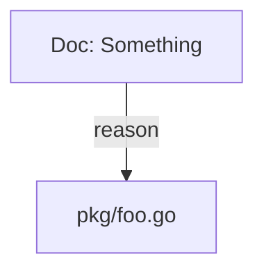
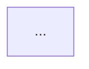

# Ticket Graph (Mermaid): Design and Implementation Guide

## Goal

This document specifies and explains how to build a new `docmgr` command that outputs a **Mermaid graph** describing a ticket’s documentation and its code relationships.

The intended outcome is a command that:

- takes a ticket ID,
- enumerates “all markdown docs in the ticket workspace”,
- extracts all `RelatedFiles` for those docs,
- optionally expands the graph transitively (doc ↔ file ↔ doc ↔ …),
- emits a valid Mermaid graph (`graph TD` or `graph LR`) that can be pasted into Markdown.

This guide is deliberately exhaustive: it covers CLI UX, output contracts, internal APIs and data sources, algorithms and limits, edge cases, and testing strategy.

## Context

`docmgr` stores ticket workspaces as directories under a docs root (often `ttmp/`) and stores document metadata in YAML frontmatter. The primary cross-link between docs and code is the frontmatter field:

- `RelatedFiles:`
  - `Path: <path>`
  - `Note: <why>`

Search (`docmgr doc search --file/--dir`) already relies on a robust path normalization and reverse lookup strategy implemented in:

- `docmgr/internal/workspace/*` (in-memory SQLite index + query engine)
- `docmgr/internal/paths/resolver.go` (normalization + fuzzy matching)

A “ticket graph” command is essentially a *specialized query + rendering layer* on top of those same primitives.

### What we mean by “files in a ticket”

This phrase is ambiguous unless we define it. In this spec, we treat two categories as graphable nodes:

1. **Ticket documents**: markdown files under the ticket directory (including:
   - `index.md`
   - other docs under `design/`, `reference/`, `playbooks/`, `various/`
   - optionally control docs like `README.md`, `tasks.md`, `changelog.md`
   - optionally archived docs under `archive/`)
2. **Related code files**: the union of all `RelatedFiles` entries across the selected ticket documents.

No code dependency parsing is implied. The tool does not parse Go imports or TS module graphs. It graphes docmgr’s own explicit doc↔file links.

### What “transitive graph” means in docmgr terms

Because docmgr only knows doc↔file relationships, “transitive” can only mean:

- start from the ticket docs,
- collect their related files (file nodes),
- then discover other docs that also reference any of those files,
- optionally collect those docs’ related files, and repeat for N layers.

This is a **knowledge graph expansion** across documentation, not a code dependency graph.

### Running docmgr in this repo

This repository’s `go.work` constraints can block running `docmgr` from the repo root. Use:

```bash
cd docmgr
GOWORK=off go run ./cmd/docmgr ...
```

## Quick Reference

### Proposed command

Primary verb:

```bash
docmgr ticket graph --ticket TICKET-ID
```

Output is a Mermaid graph (by default wrapped as a Markdown mermaid code fence).

### Flags (proposed)

**Ticket selection**

- `--ticket <id>` (required): ticket ID.
- `--root <dir>`: docs root resolution as everywhere else (default `"ttmp"` but `.ttmp.yaml` may override).

**Graph scope**

- `--include-control-docs` (default true): include `README.md`, `tasks.md`, `changelog.md` in the doc node set.
- `--include-archived` (default false): include docs under `archive/`.
- `--include-scripts-path` / `--include-sources-path` (default false): whether to include docs under `scripts/` or `sources/` if present in a workspace.

**Transitive expansion**

- `--depth <n>` (default 0): BFS depth.
  - 0 = ticket docs + their related files only.
  - 1 = also include other docs referencing those files.
  - 2+ = repeat outward.
- `--expand-files` (default false): when discovering new docs during transitive expansion, also add their `RelatedFiles` to the file frontier.
  - If false, you still add the docs, but you do not expand the file frontier further (safe default to avoid graph explosion).
- `--scope <ticket|repo>` (default `ticket` when depth=0, `repo` must be explicit for depth>0):
  - `ticket`: only include docs in the original ticket (transitive expansion is effectively a no-op).
  - `repo`: allow discovering docs in other tickets.

**Output formatting**

- `--format <mermaid|markdown>` (default `markdown`):
  - `mermaid`: output only Mermaid DSL.
  - `markdown`: wrap in a ```mermaid code fence.
- `--direction <TD|LR>` (default `TD`): Mermaid graph direction.
- `--group-by-ticket` (default true): emit Mermaid `subgraph` blocks per ticket when scope includes external docs.
- `--label <path|title|both>` (default `both`): how to label doc nodes.
- `--path-style <repo-rel|docs-rel|abs>` (default `repo-rel`): how to label code file nodes.
- `--edge-notes` (default `short`): include `RelatedFiles.Note` as edge labels (shortened/escaped).

**Safety limits**

- `--max-nodes <n>` (default 500)
- `--max-edges <n>` (default 2000)
- `--batch-size <n>` (default 50): number of file keys per repo query batch in transitive expansion.

### Mermaid output contract (summary)

- Each node must have a stable Mermaid identifier (letters/numbers/underscore).
- Labels must be escaped/sanitized so they cannot break Mermaid syntax.
- Edge labels (notes) must be size-limited and escaped.

### A mental model in one diagram

```text
ticket graph:
  Ticket -> Docs (markdown)
  Docs   -> RelatedFiles (code)

transitive expand (repo scope):
  File nodes -> Other docs referencing same file
  (optional) Other docs -> Their related files -> ...
```

## Usage Examples

### 1) Ticket-only graph (no transitive expansion)

```bash
docmgr ticket graph --ticket MEN-4242 > graph.md
```

### 2) Ticket graph without control docs

```bash
docmgr ticket graph --ticket MEN-4242 --include-control-docs=false
```

### 3) Repo-wide expansion to include external docs that reference ticket files

Safe-ish default (depth=1, do not expand files from external docs):

```bash
docmgr ticket graph --ticket MEN-4242 --scope repo --depth 1 --expand-files=false
```

More aggressive expansion (can blow up):

```bash
docmgr ticket graph --ticket MEN-4242 --scope repo --depth 2 --expand-files=true --max-nodes 2000 --max-edges 8000
```

### 4) Emit raw Mermaid DSL for embedding elsewhere

```bash
docmgr ticket graph --ticket MEN-4242 --format mermaid > graph.mmd
```

## Implementation Guide (Deep Dive)

### 0) Where this command should live in the codebase

Follow the existing pattern used by other ticket subcommands:

- Cobra wiring:
  - create `docmgr/cmd/docmgr/cmds/ticket/graph.go`
  - add it to `docmgr/cmd/docmgr/cmds/ticket/ticket.go` via `ticketCmd.AddCommand(graphCmd)`
- Command implementation (glazed dual mode):
  - add `docmgr/pkg/commands/ticket_graph.go` (or similar)
  - implement both:
    - `RunIntoGlazeProcessor(...)` for structured output (edges/nodes rows)
    - `Run(...)` for human output (mermaid markdown)

This keeps the feature consistent with the rest of docmgr’s CLI structure.

### 1) Data sources you should rely on (and why)

Do **not** implement this by walking the filesystem and parsing YAML yourself. Use the canonical stack:

1. `workspace.DiscoverWorkspace(...)` to resolve docs root + anchors.
2. `ws.InitIndex(...)` to build the in-memory SQLite index.
3. `ws.QueryDocs(...)` to enumerate documents and their `RelatedFiles`.
4. `paths.Resolver` to normalize and display file nodes consistently.

This ensures the graph respects docmgr’s skip rules (`.meta`, `_...`) and handles parse errors consistently.

### 2) What you need from the index

The graph builder needs, for each included document:

- a stable identifier for the doc node (the doc’s path is the best key),
- doc metadata (ticket, title, doc type, status),
- its `RelatedFiles` list (path + note).

All of that is already available from `Workspace.QueryDocs`:

- doc rows come from `docs`
- related files are hydrated from `related_files`

You do **not** need document bodies for graph generation. Use `IncludeBody=false`.

### 3) Canonical algorithm: build a bipartite graph

At depth 0 (ticket-only):

- Nodes:
  - all docs in the ticket
  - all unique related files referenced by those docs
- Edges:
  - `doc -> file` for each `RelatedFiles` entry

This is a bipartite graph (docs on one side, files on the other).

#### 3.1 Pseudocode: ticket-only graph

```text
BuildTicketGraph(ticketID, opts):
  ws := DiscoverWorkspace(rootOverride)
  ws.InitIndex(IncludeBody=false)

  docs := QueryDocs(ScopeTicket(ticketID), opts.docFilters)

  for each doc in docs:
    add doc node
    for each relatedFile in doc.RelatedFiles:
      fileKey := CanonicalizeRelatedFile(docPath, relatedFile.Path)
      add file node (fileKey)
      add edge docPath -> fileKey (label=relatedFile.Note)

  return graph
```

Key detail: `CanonicalizeRelatedFile` should use a resolver anchored at the document path (same as search’s display logic), so doc-relative `../` entries become stable.

### 4) Defining “transitive expansion” (BFS over docs and files)

Transitive expansion only makes sense if you allow scope beyond the ticket. Otherwise, the ticket’s doc set is already fully enumerated.

We define a BFS that alternates between:

- file frontier → docs that reference those files
- (optional) those docs’ related files → next file frontier

#### 4.1 BFS state

Maintain these sets:

- `seenDocs` keyed by doc path
- `seenFiles` keyed by a canonical file key (repo-relative when possible)
- `frontierFiles` for expansion at the next depth

Also maintain:

- `nodeCount`, `edgeCount` to enforce limits
- `batchSize` to query many files at once

#### 4.2 Pseudocode: transitive expansion

```text
BuildTransitiveGraph(ticketID, opts):
  base := BuildTicketGraph(ticketID, opts with depth=0)

  if opts.depth == 0:
    return base

  frontierFiles := base.files

  for level in 1..opts.depth:
    if frontierFiles empty: break

    for each batch in chunk(frontierFiles, opts.batchSize):
      // repo-scope: find any docs referencing any file in batch
      docs2 := QueryDocs(
        ScopeRepo,
        Filters{ RelatedFile: batch },
        Options{ IncludeErrors=false, IncludeControlDocs=true, IncludeArchivedPath=opts.includeArchived }
      )

      for each doc in docs2:
        if opts.scope == "ticket" and doc.Ticket != ticketID: continue
        add doc node (if new)
        add edges doc -> files it references that are in batch (and optionally all its related files)

        if opts.expandFiles:
          for each rf in doc.RelatedFiles:
            add file node
            if file node is new: add to nextFrontierFiles

    frontierFiles = nextFrontierFiles

  return graph
```

This describes the *shape* of the algorithm. In practice, you’ll want to:

- deduplicate within a batch,
- avoid emitting edges twice,
- optionally only connect a newly discovered doc to the *triggering* file(s) (to keep graphs readable),
- if `RelatedFile` triggers include basename-only keys (e.g. `main.go`), mirror `QueryDocs`’ basename suffix matching (`%/main.go`) when deciding which edges are “triggering” (otherwise discovered docs can become orphaned in `--expand-files=false` mode),
- enforce `max-nodes/max-edges` aggressively.

### 5) Choosing canonical keys and labels (docs vs files)

Mermaid graphs require stable node IDs. Paths are not safe Mermaid IDs.

#### 5.1 Node identity (internal)

Use these internal keys:

- Doc key: absolute doc path (or docs-root-relative path; absolute is safest unique key).
- File key: canonicalized file path (prefer repo-relative if inside repo, else abs).

These keys are **not** emitted directly as Mermaid IDs; they are inputs to an ID generator.

#### 5.2 Node IDs (Mermaid-safe)

Define a deterministic mapping:

```text
Doc node id:  D_<hash(docPath)>
File node id: F_<hash(fileKey)>
```

Where `<hash>` is a stable short hex (e.g., first 10 chars of SHA1 or xxhash).

This guarantees:

- no collisions in practice,
- no Mermaid syntax issues,
- stable graphs across runs.

#### 5.3 Labels (human-readable)

Proposed label defaults:

- Doc nodes: `"<DocType>: <Title>\\n(<rel-path>)"`
- File nodes: `"<repo-rel-path>"` (or abs when outside repo)

Sanitize labels:

- replace newlines with `\\n` (Mermaid label newline escape),
- escape `"` and `]` and other bracket-like characters,
- enforce a max label length (truncate with `…`).

#### 5.4 Edge labels (notes)

`RelatedFiles.Note` is often long. Edge labels should be:

- optional (flag-controlled),
- truncated (e.g., 80 chars),
- sanitized (remove newlines, quotes, `|`).

### 6) Mermaid rendering strategy

Mermaid syntax for a directed graph:



Recommended rendering decisions:

- Use `graph TD` by default (readable vertically).
- Group by ticket using Mermaid `subgraph` when you include external docs.
- Apply Mermaid `classDef` styles:
  - docs as rectangles,
  - files as rounded boxes,
  - external docs as dashed.

Example (conceptual):

```mermaid
graph TD
  subgraph TICKET_MEN_4242["MEN-4242"]
    D1["design-doc: WebSocket lifecycle\n(…/design/01-...)"]
  end

  subgraph TICKET_MEN_5678["MEN-5678 (external)"]
    D2["reference: API notes\n(…/reference/02-...)"]
  end

  F1(["backend/chat/ws/manager.go"])

  D1 -->|\"Why this file matters\"| F1
  D2 --> F1

  classDef doc fill:#eef,stroke:#446,stroke-width:1px;
  classDef file fill:#efe,stroke:#464,stroke-width:1px;
  class D1,D2 doc;
  class F1 file;
```

### 7) Output modes (human vs structured)

Even though the primary requested output is Mermaid, a good CLI design gives you both:

#### 7.1 Human output (default)

Emit Markdown with an embedded Mermaid code block:

```markdown

```

This is immediately pasteable into docs.

#### 7.2 Structured output (glaze mode)

Emit an edge list (and optionally node metadata) so scripts can:

- transform to other formats (GraphViz DOT, JSON, D2),
- run analysis (degree, connected components),
- enforce constraints in CI.

Proposed glazed schema (edges):

| field | meaning |
|---|---|
| `from_type` | `doc` or `file` |
| `from_key` | internal key (path) |
| `to_type` | `doc` or `file` |
| `to_key` | internal key (path) |
| `label` | edge label (note) |
| `ticket_from` | ticket ID if from is a doc |
| `ticket_to` | ticket ID if to is a doc |

Then have a separate `--output mermaid` mode that converts the same internal edge list to DSL.

### 8) Testing strategy

This command is output-heavy. Testing should focus on determinism and correctness of:

- selection (which docs are included),
- normalization (file keys),
- graph expansion (depth, scope, batching),
- Mermaid validity (IDs and labels),
- limit enforcement.

Recommended test layers:

1. **Unit tests** for:
   - node ID generation and label sanitization,
   - deterministic Mermaid rendering (golden snapshots).
2. **Workspace-backed tests** (similar to existing `internal/workspace/*_test.go` patterns):
   - create a temp docs root with a minimal ticket structure,
   - include docs with controlled `RelatedFiles` values (repo-rel + doc-rel + abs),
   - run graph builder and assert node/edge sets.
3. **Scenario script** under `docmgr/test-scenarios/`:
   - a small synthetic repo with two tickets sharing a file reference,
   - verify `--depth 1 --scope repo` includes the external ticket doc.

### 9) Performance and operational safety

This command can be expensive in large workspaces when you enable repo-wide transitive expansion.

Mitigations:

- default `--depth 0`
- require explicit `--scope repo` to expand beyond the ticket
- batch file queries (`--batch-size`)
- strict `--max-nodes` and `--max-edges` defaults
- optionally provide `--explain` that prints counts and limits hit (without emitting a giant graph)

### 10) “Second pair of eyes” checklist (review risks)

When implementing the command, reviewers should pay attention to:

- Correct ticket resolution (no ambiguous index docs).
- Correct handling of parse errors (skip invalid docs by default; optionally include with warnings).
- Canonicalization consistency (same file should not appear as multiple nodes).
- Mermaid escaping (labels and edge notes must not produce invalid DSL).
- Limit behavior (graph should stop expanding deterministically when limits are hit).
- Transitive semantics (especially `--expand-files` and `--scope` interactions).

## Related

- Diary for this ticket: `docmgr/ttmp/2026/01/03/002-ADD-TICKET-GRAPH--add-ticket-graph-command-mermaid/reference/01-diary.md`

## Related

<!-- Link to related documents or resources -->
