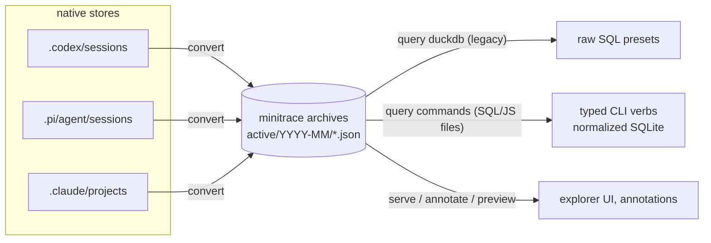

# go-minitrace field report: assessment from the docmgr usage-mining project

## 1. Executive summary

For ticket DOCMGR-200 we used go-minitrace as the primary instrument to answer a real question — *how do coding agents actually use docmgr, and where do they struggle?* — over three native transcript stores (~2,000 candidate sessions, several GB). We ran the full pipeline: discovery, staged conversion of a 240-session sample (codex, pi, claude-code), and analysis exclusively through **JS query commands** (six custom verbs in a project query repository). This report is the requested assessment of go-minitrace itself: what was good, what we fought, and what we'd change — written with the same evidence discipline as the docmgr guide, including a **measured adapter-fidelity table** (NULL rates per column per framework) and file:line anchors into the go-minitrace source at `~/code/wesen/go-go-golems/go-minitrace`.

The one-paragraph verdict: **the destination is right and the core is strong** — a normalized, well-documented schema; a genuinely pleasant builder-style JS API; typed CLI commands generated from `__section__`/`__verb__` markers; conversion fast enough to be interactive (240 sessions in minutes). The friction is concentrated at the *edges*: getting the right sessions **in** (no cwd-aware discovery, no per-session conversion for codex/claude, home-shaped vs dir-shaped `--source-dir` inconsistency forced a symlink-staging workaround), getting errors **out** (raw Goja stack traces, empty files on failed `--output json`, unhelpful "Too many arguments" on wrong command paths), and knowing **what the data means** (per-adapter fidelity is undocumented; `exit_code` exists only for codex, `duration_ms` only for codex, thinking is 100% absent for claude-code, `outcome_success` is never populated by anything). A duplicated query stack (legacy DuckDB path beside the new SQLite builder path) is the one structural item we'd call misshapen; the skill/docs ecosystem still teaches the legacy path in places.

## 2. How this assessment was produced

Everything here comes from one afternoon of intensive real use plus a source review:

1. **The workload** (see the DOCMGR-200 diary for blow-by-blow): corpus narrowing over `~/.codex/sessions`, `~/.pi/agent/sessions`, `~/.claude/projects`; `scripts/03-stage-and-convert.sh` symlink-staging top-usage sessions into store-shaped trees; `go-minitrace convert codex|pi|claude-code`; six JS query verbs (`scripts/query-commands/docmgr/{probe,usage,paths,volume,fidelity}.js`) executed via `go-minitrace query commands docmgr …`; results in `sources/minitrace-*.json`.
2. **The measurements**: the `fidelity` verb computes NULL/empty rates per analytically important column per framework over the converted sample (98 codex + 88 pi + 54 claude sessions) — the basis for section 8.
3. **A source review** of the go-minitrace repo (converter adapters, schema/normalization, JS runtime, CLI wiring, manifests, docs) with file:line anchors — integrated into sections 6–10.

Bias disclosure: our workload is *cross-session batch analytics*. go-minitrace also serves single-session inspection (`preview`, `serve`, annotations) which we only sampled; ergonomic judgments weigh the batch path most heavily.

## 3. What go-minitrace is — the mental model

go-minitrace ingests **native transcript stores** from coding-agent frameworks and produces **minitrace archives**: one normalized JSON document per session (`active/YYYY-MM/<id>.minitrace.json` + `manifest.json`), with a stable schema (sessions, turns, tool_calls, events, attachments, annotations, metrics). On top of the archives sit three query surfaces:



The unit of reuse is the **query repository**: a directory of `.sql` and `.js` files whose `__section__`/`__verb__` markers are scanned into real CLI commands with typed flags (`go-minitrace query commands <group> <verb> --archive-glob …`). JS handlers get `require("minitrace")` — a builder API that assembles sources → policies → limits → a read-only SQLite handle (`mt.db().RuntimeArchives().QueryCommandDefaults().Build()`).

## 4. What was good

Concrete positives, each of which saved us real time:

1. **The normalized `tool_calls` table is exactly the right shape for behavioral mining.** `command`, `success`, `exit_code`, `error`, `result`, `position_in_session`, `tools_before_json`, plus session joins — we reconstructed failure→retry chains across 14,166 docmgr calls without ever touching raw JSONL. The schema help (`go-minitrace help minitrace-schema`) documents every field.
2. **The JS API's shape is right.** SQL for the heavy lifting, JS for what SQL is bad at (regex extraction of `docmgr <verb>` from shell commands, error-signature classification, per-session sequence analysis). `mt.sql.stringIn()`/`.like()` helpers avoided injection footguns. The builder chain reads like the sentence you'd say aloud.
3. **Markers turn scripts into products.** Adding `__section__("filters", {fields: …})` + `__verb__` gave every analysis typed `--framework`/`--limit`/`--flag` flags, `--output json|table`, and discoverability under `query commands --help` — for free. Our six verbs are now reusable by anyone with the ticket checkout (`--query-repository <dir>`).
4. **Conversion is fast and quiet.** ~240 sessions across three adapters in a few minutes, no babysitting; per-session diagnostics rows tell you what happened. Symlinked JSONL files are followed, which made zero-copy staging possible.
5. **Embedded documentation is unusually complete.** `help js-api-reference`, `help minitrace-schema`, `help structured-query-commands`, `help duckdb-query-recipes` — we authored six working JS commands without reading go-minitrace source once (the source was only needed for this assessment).
6. **`preview session` is a good validation tool**: per-session role/tool/event breakdowns with privacy tiers (`structural|snippets|full`), which let us sanity-check adapter output before batch conversion.

## 5. Friction log (chronological, with exact errors)

Everything that cost a debugging loop, in the order we hit it:

| # | Friction | Exact symptom | Workaround | Cost |
|---|---|---|---|---|
| F1 | No cwd/repo filter in discovery | `discover codex` emits only `id, format_hint, source_path` (verified) — can't ask "sessions that worked in repo X" or "sessions that ran docmgr" | grep the raw stores (`rg -c 'docmgr (doc\|ticket\|…)'`) to build a hits list | ~30 min + feels like defeating the tool |
| F2 | Subset conversion needs staging | `convert codex`/`claude-code` accept only `--source-dir` (whole store); only `convert pi` has `--source-session` | `scripts/03-stage-and-convert.sh`: symlink selected JSONL into store-shaped trees | the single biggest workaround of the project |
| F3 | Inconsistent `--source-dir` shapes | codex wants a **home**-shaped dir (containing `sessions/`); pi/claude want the sessions/projects dir itself | read `--help` per adapter, then trial | one failed run |
| F4 | `sqlite_master` disallowed in JS | `GoError: query references disallowed table/view "sqlite_master"` | `db.schema()` (works well, but the error doesn't point to it) | one loop |
| F5 | Wrong command path → opaque error | `query commands docmgr fidelity fidelity` → `Error: Too many arguments` (the self-named single-verb file collapses to `docmgr fidelity`; the error names neither the resolved path nor candidates) | guessed the collapse rule from the help page | one loop |
| F6 | Failed verb + `--output json` writes nothing | stderr got the Goja trace; stdout redirect produced a 0-byte file our downstream `json.load` choked on | check file sizes after every run | one loop |
| F7 | JS errors are raw Goja stack traces | multi-line native traces for a one-line SQL mistake | read the first line only | recurring annoyance |
| F8 | Legacy vs current API confusion | the transcript-analysis skill and older docs teach `mt.query()` + `sessions_base` + DuckDB presets; the current runtime is builder-based with normalized tables | trusted `help js-api-reference` over the skill | ~15 min |
| F9 | Adapter fidelity undocumented | pi `avg(duration_ms)` returned NULL in our first stats query; no doc says which adapters populate which columns | wrote the `fidelity` probe (section 8) | one loop, then a feature |

None of these is fatal; all of them are the kind of thing a first-time user hits in the first hour, which is exactly when tools get abandoned.

## 6. CLI ergonomics assessment

All anchors relative to the go-minitrace repo. The CLI's core promise — files in, typed commands out — is delivered, but the surface has grown adapter-by-adapter and it shows:

1. **`--source-dir` means a different thing per converter.** codex = HOME-shaped dir (`cmd/go-minitrace/cmds/convert/codex.go:57`, with `codex.Discover` appending `/sessions` itself, `pkg/adapters/codex/discover.go:20-23`); pi = the sessions dir (`pi.go:54`); claude-code = the projects dir (`claude_code.go:59`); chatgpt/claude-ai/turnsdb take `--source` (a file/ZIP) instead. Same flag name, four contracts.
2. **Only pi has `--source-session`** (`pi.go:55`). For codex/claude-code the only subset path is staging a fake store — our biggest workaround (F2). `mt.importer().File()` exists in JS but doesn't write the `active/YYYY-MM/` layout (it writes `rootDir/<id>/session.minitrace.json`, `pkg/minitracejs/import_builder.go:397-415` — a third archive layout).
3. **Discovery is name-only.** `adapters.SessionLocator` has exactly `id, format_hint, source_path` (`pkg/adapters/types.go`); `discover` never opens files beyond format sniffing, so cwd/repo/date filters are impossible (F1). discover also covers only 4 of the 8 convert formats (`discover/root.go:30` vs `convert/root.go:49`).
4. **Convert aborts on first bad session** (`convert/codex.go:82-85`): one corrupt JSONL kills a 240-session batch. `troubleshooting.md:18-24` documents this instead of fixing it with skip-and-report.
5. **Filter-flag drift**: `--id-filter` (chatgpt) vs `--uuid-filter` (claude-ai) vs `--conv-id` (turnsdb); `validate --path` vs `preview --source-session` vs `query --archive-glob`.
6. **Two flag idioms coexist**: glazed sections for convert/query-runtime vs legacy cobra islands in `annotate/*`, `serve`, and the `query commands` root (each carrying `//glazedclilint:file-ignore legacy` pragmas).
7. **Error text does not know the command tree.** `Too many arguments` for a mis-pathed verb (F5) comes from argument parsing after the collapse rule (`pkg/minitracecmd/parse_javascript.go:42-49`, `jsCommandPath` :88-101) has silently shortened the path; neither the resolved path nor near-miss candidates are printed.

What the CLI gets right: `--dry-run` on all converters, per-session diagnostics rows in convert output, glazed dual output everywhere modern, and `help` topics that are genuinely load-bearing.

## 7. JS API assessment

**The good.** The builder API is the strongest part of the whole tool. Error accumulation in the chain with surfacing at `Build()`/`Validate()` (`pkg/minitracejs/db_builder.go:442-486`) means you never check errors mid-chain; Go-owned handles keep lifecycle explicit; `QueryCommandDefaults()` is the right one-liner for the common case. The **query sandbox is the best-engineered subsystem in the repo**: three independent layers — prefix/literal validator (`pkg/minitracedb/query.go:204-348`), `stmt.Readonly()` verification (:364-384), and a SQLite authorizer (:409-431) — with per-query timeouts and sane row/column/cell limits.

**The sharp edges**, now explained by source:

- **`sqlite_master` denial (F4)** is the authorizer checking `SQLITE_READ` objects against `minitracedb.AllowedTableNames()` — exactly the 10 schema tables (`db_builder.go:505`, `schema.go:52-59`). Deliberate and defensible; the fix is purely the error message (point at `db.schema()`/`db.tables()`, which exist at `db_builder.go:831-835`) plus perhaps allowlisting `pragma_table_info`.
- **Raw Goja stack traces (F7)**: `RunJSCommandIntoProcessor` returns the goja exception unwrapped (`cmd/.../query/js_runtime.go:89-93`). The SQL side already has the right pattern — `QueryResult.Error` structured with a SQL preview (`query.go:95-105`) — the JS side just doesn't use it.
- **The hidden DuckDB toll**: the structured-command runtime **always loads every `--archive-glob` match into a DuckDB `sessions_base` table before dispatch** (`pkg/minitracecmd/command_runtime.go:86-99`), then hands the JS runtime a connection that is explicitly discarded (`pkg/minitracejs/module.go:23`: `_ = conn // Legacy host-table query access was removed`). Every `mt.db()` JS command pays the archive load **twice** (DuckDB + SQLite), and `--archive-glob` is mandatory even for scripts using `.File()`/`.Content()`. On our 1.1 GB archive set this is real wall-clock on every verb invocation.
- **Double scanning**: the query-repo source tree is scanned once at catalog build (`parse_javascript.go:18-25`) and re-scanned on every execution (`js_runtime.go:47`, verb re-located by ModulePath+FunctionName :96-109).
- **Vestigial runtime**: `mt.runtime.dbPath/tableName/persistLoaded` exist only as documented-legacy fields (`module.go:57-63`); `frameFor`'s `stats.chars/estimatedTokens` are initialized and never updated (`query_view_session.go:295-302`).

**Verdict**: the API design is right; the execution engine underneath it needs the legacy path amputated.

## 8. Data schema and adapter fidelity

### 8.1 The schema itself

The normalized model (10 SQLite tables from `pkg/minitracedb/schema.go:37-50`, archive structs in `pkg/minitrace/schema.go`) is well-chosen for analytics: `tool_calls` with position/context, `turn_tool_calls` join table, first-class `events`/`attachments`, `raw_json` escape hatches on every row. Two structural criticisms:

1. **Aspirational surface**: roughly a third of the schema has **no writer anywhere** — `Outcome` (confirmed empirically: `outcome_success` 100% NULL for all three frameworks), `Condition`, `Coordination.*`, `Handover.*`, `Context.TimeSinceLastUser` (declared `schema.go:175`, never set), `Metrics.SubagentToolCalls` (hardcoded 0, `metrics.go:106`), `Usage.ToolTokens`, `Environment.Temperature`. Permanently-NULL columns actively mislead query authors (we budgeted analysis time for `time_since_last_user` before discovering it's never populated).
2. **Derived and source events share one table**, distinguished only by `kind` (`materialize.go:219-251` generates synthetic per-turn/per-tool events beside source events) — workable, but an `origin` column would make `events` self-describing.

Also now explained: the **~10 KB result cap we measured is go-minitrace's own** `TruncateLimit = 10240` applied at conversion (`pkg/minitrace/util.go:19`), with a second 4,000-char default cell cap at JS query time (`query.go:37`, raisable via `.MaxCellChars()`). Related bug: `TruncateContent` pre-caps input at 40 KiB **before** computing `full_bytes`/`full_hash` (`util.go:161-163`), so provenance fields lie for any output >40 KiB.

### 8.2 Measured adapter fidelity (our sample: 98 codex / 88 pi / 54 claude sessions)

NULL/empty rates from `scripts/query-commands/docmgr/fidelity.js` (`sources/minitrace-fidelity.json`):

| column (null %) | claude-code | codex | pi |
|---|---|---|---|
| tool_calls.duration_ms | **100** | 16.4 | **100** |
| tool_calls.exit_code | **100** | 4.5 | **100** |
| tool_calls.error | 96.4 | 95.5 | 95.4 |
| tool_calls.justification | 100 | 99.8 | 100 |
| turns.thinking | **100** | 34.4 | 63.8 |
| turns.input/output_tokens | 6.4 | 20.2 | 8.8 |
| sessions.git_branch | 29.6 | **100** | **100** |
| sessions.system_prompt | 100 | 10.2 | 100 |
| sessions.outcome_success | 100 | 100 | 100 |

### 8.3 Why (source-anchored root causes)

- **codex is the only adapter with duration/exit_code because Codex embeds them in the tool output text**, and the adapter scrapes them (`parseFunctionOutput`, `codex/convert.go:969-1028`: structured `{metadata:{exit_code, duration_seconds}}` or `"Wall time: X"` lines). Nothing computes durations from timestamps.
- **pi/claude-code could derive duration but destroy the input**: both overwrite the tool-call *emit* timestamp with the *result* timestamp (`pi/convert.go:430`, `claudecode/convert.go:199`), making the emit→result delta irrecoverable from the archive.
- **claude-code drops `toolUseResult` entirely** — the record-level object carrying `{stdout, stderr, interrupted, ...}`; `grep -rn toolUseResult pkg/adapters` finds nothing. This is the single biggest fidelity loss: structured exit semantics, stderr, and interrupt status all exist in the source and vanish.
- **claude-code `thinking` 100% NULL in our sample** despite mapping code existing (:254-256) — worth investigating whether current Claude Code JSONL puts thinking somewhere the adapter doesn't look; either way the fidelity matrix would have caught it earlier.
- **claude git_branch/cwd fragility**: read from `records[0]` only (:82-95); transcripts starting with a `file-history-snapshot` record get NULLs even though later records carry both — matches our measured 29.6%.
- **codex git_branch 100% NULL**: `session_meta` fields outside a fixed 7-key set are dropped (:308-317) — including `parent_thread_id`, which would give real subagent linkage instead of scraping UUIDs from `spawn_agent` output text (:834-840).
- **success semantics are not comparable across frameworks**: codex `success = exit_code==0`; pi/claude `success = !is_error`, where claude's `is_error` also covers user interrupts. Cross-framework failure-rate comparisons (like ours in the docmgr report) need this caveat printed on them.
- Correctness bug found on the way: codex **exec-format** tool calls all alias one `EmittingTurnIndex` pointer (`codex/convert.go:541` passes `&turnIndex` of the loop variable; contrast the session-format's `turnIndexCopy` at :370-371) — every exec tool call reports the final turn index.

## 9. What is fundamentally misshapen

One item earns the word, and two more are close:

1. **The dual query stack, with the legacy half load-bearing.** DuckDB (`pkg/query/engine.go`: JSON-blob columns, string-interpolated file lists, no limits, `panic` on glob errors :61-67) and normalized SQLite (`pkg/minitracedb`) duplicate validators, normalizers, and truncation regimes — *and* the modern path still pays the legacy toll on every invocation (§7), *and* `serve` (the web explorer) is built entirely on DuckDB while docs steer scripts to SQLite. This is not a transition; it's two engines welded together. The endgame should be: SQLite everywhere, DuckDB either removed or demoted to an explicit `query duckdb` power tool with no role in the command runtime.
2. **Three archive layouts, zero reconcilers**: `active/YYYY-MM/` + manifests (write-only, last-invocation-wins — `WriteManifests` builds manifests exclusively from the current invocation's in-memory index, `archive.go:92-251`, so cross-framework converts into one dir silently disagree with disk); the importer's `rootDir/<id>/` scheme; and the annotation SQLite synced back into JSON by a manual verb. Nothing ever re-scans a directory to reconcile. Since nothing consumes manifests for querying anyway (`engine.go:101-133` globs files directly), manifests are currently pure liability.
3. **Schema-first, writers-later**: the aspirational third of the schema (§8.1). Either populate (`Outcome` is the obvious one — sessions have ends), degrade honestly (drop columns no adapter fills), or document per-adapter support. The current state silently converts schema ambition into analyst confusion.

## 10. What should be added or changed (prioritized)

**P0 — correctness (small diffs, real payoffs):**
1. Stop overwriting emit timestamps; set `duration_ms = result_ts - emit_ts` for pi/claude-code (`pi/convert.go:430`, `claudecode/convert.go:199`).
2. Read claude-code `toolUseResult` → stdout/stderr/interrupted/exit semantics (`claudecode/convert.go` around :183-198).
3. Fix codex exec `EmittingTurnIndex` aliasing (`codex/convert.go:541`).
4. Fix `TruncateContent` to hash/size the full content before capping (`util.go:161-163`).
5. Scan all records (not `records[0]`) for claude cwd/gitBranch (`claudecode/convert.go:82-95`); keep codex `parent_thread_id` (`codex/convert.go:308-317`).
6. Convert: skip-and-report per-session failures instead of aborting the batch (`convert/codex.go:82-85`).

**P1 — the intake path (kills our two biggest workarounds):**
7. `--source-session` (repeatable) + `--source-list <file>` on **all** converters, writing the standard layout.
8. `discover --with-cwd` / `--cwd-contains` / `--since`: read the cheap header line per session (codex `session_meta.cwd`, pi `session.cwd`, claude record cwd) during discovery; extend `SessionLocator` accordingly.
9. Unify `--source-dir` semantics (dir-of-sessions everywhere; accept the home shape with a deprecation note).
10. Manifests: read-merge-write, or a `manifest rebuild` verb, or delete manifests.

**P2 — the analyst experience:**
11. JS error envelopes: map goja exceptions to the structured error pattern SQL already has; on failure with `--output json`, emit `{"error": …}` instead of nothing.
12. Better wrong-path errors for query commands: print the resolved path and candidates (the collapse rule is invisible today).
13. Point the `sqlite_master` denial at `db.schema()`.
14. **A fidelity matrix help page** (adapter × column: mapped/scraped/derived/never) — our section 8.2 table is the seed; keep it honest with a CI test that recomputes NULL rates over the testdata corpus.
15. Remove the unconditional DuckDB preload for JS commands (`command_runtime.go:86-99`); make `--archive-glob` optional when the script builds its own sources.
16. Fix doc drift: `query.md`'s claim that events/attachments are DuckDB-queryable (they're SQLite-only — `engine.go:80-95` enumerates the DuckDB columns), the stale adapter-reference tool tables.
17. Disk-cache eviction or a size bound for `~/.cache/go-minitrace/minitracedb` (`db_builder.go:667-676`) — every source-set × option combo currently leaves a `.sqlite` file forever.
18. Rethink `DetectPIIInPaths` (`util.go:231-241`): flagging every `/home/` path makes `contains_pii`/`for_research`/`classification` constants, not signals.

**P3 — bigger swings, worth a design doc each:** single query engine (SQLite) with `serve` ported off DuckDB; an `Outcome` writer (heuristic or LLM-assisted); per-adapter `success` semantics normalization (e.g. a `success_source` column: exit_code / is_error / inferred).

## 11. Reproduction

```bash
# fidelity matrix over any converted archive set
go-minitrace query commands docmgr fidelity \
  --query-repository <ticket>/scripts/query-commands \
  --archive-glob '<work>/archive/*/active/*/*.minitrace.json' --output json

# the friction reproductions
go-minitrace discover codex | head -3                      # F1: no cwd column
go-minitrace convert codex --help                          # F3: home-shaped --source-dir
echo 'SELECT * FROM sqlite_master' # in any JS handler     # F4: authorizer denial
go-minitrace query commands docmgr fidelity fidelity ...   # F5: "Too many arguments"
```

Source anchors were verified against `~/code/wesen/go-go-golems/go-minitrace` on 2026-07-05. The converted-sample fidelity numbers are in `sources/minitrace-fidelity.json`; the staging pipeline that produced the sample is `scripts/03-stage-and-convert.sh`.

## 12. Key file reference (go-minitrace repo)

| Area | Files |
|---|---|
| Adapters | `pkg/adapters/{codex,pi,claudecode}/convert.go`, `pkg/minitrace/{builders,metrics,util}.go` |
| Archive layout / manifests | `pkg/minitrace/archive.go` (WriteSession :31-90, WriteManifests :92-251) |
| Normalized SQLite | `pkg/minitracedb/{schema,materialize,query,cache,db_builder... }.go` |
| JS runtime | `pkg/minitracejs/{module,db_builder,query_view_session,import_builder}.go` |
| Query commands runtime | `pkg/minitracecmd/{command_runtime,parse_javascript}.go`, `cmd/go-minitrace/cmds/query/{js_runtime,runtime_section,commands}.go` |
| Legacy DuckDB engine | `pkg/query/engine.go`, `pkg/query/validation.go` |
| CLI | `cmd/go-minitrace/main.go`, `cmd/go-minitrace/cmds/{convert,discover,preview,serve,annotate,validate}/` |
| Docs | `pkg/doc/*.md` (22 pages; see §6 of the source review for drift list) |
| This project's instruments | ticket `scripts/query-commands/docmgr/{probe,usage,paths,volume,fidelity}.js`, `scripts/03-stage-and-convert.sh`, `sources/minitrace-*.json` |
