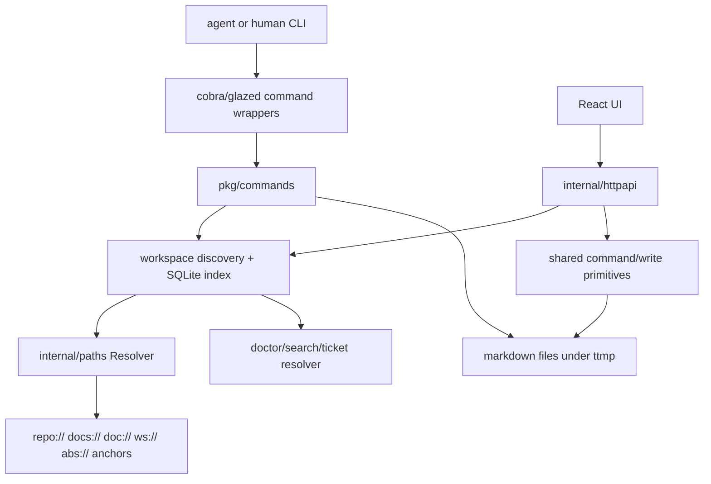

# PR 43 code review and project review

## 1. Executive summary

PR 43 is a large, mostly coherent implementation of the DOCMGR-200 design: it fixes many of the original agent-facing failures, introduces explicit path anchors, adds a more useful doctor, makes the CLI quieter and more forgiving, gives the UI several missing write paths, refreshes help/docs, and adds focused regression tests. The broad direction is correct. The implementation also dogfoods the ticket workspace and leaves good evidence in `ttmp/.../DOCMGR-200...`.

My merge recommendation is **hold until the three correctness blockers and one CI blocker are resolved**:

1. **Blocker: `doc add --ticket <forgiving-prefix>` can create an orphaned document.** The command resolves the ticket directory correctly, but it writes the unresolved user input into the new document's `Ticket:` frontmatter. Because later ticket views query by canonical `Ticket`, the new document disappears from `ticket show` and ticket-scoped queries. I reproduced this with `CANON-1` resolving to `CANON-1-long-canonical`.
2. **Blocker: `doctor --ticket <forgiving-prefix>` can check zero tickets.** `ticket show DOCMGR-200` resolves correctly, but `doctor --ticket DOCMGR-200` returned `No tickets checked.` because doctor passes the raw string into an exact `ScopeTicket` SQL filter before grouping.
3. **Blocker/high: stable task IDs are not wired through the HTTP/UI writer.** The API returns `stableId`, but `POST /tickets/tasks/check` accepts only `[]int`, calls the positional toggle helper, and the UI sends `it.id`. This leaves the new browser write path vulnerable to the same positional-ID drift that PR 43 set out to remove from the CLI.
4. **Merge blocker: GitHub Advanced Security CodeQL is failing.** The GitHub Actions CodeQL workflow passes, but the separate `github-advanced-security` check reports one high-severity alert at `internal/paths/resolver.go:350` (`matchKeys`). This may be a false positive because that code compares strings rather than opening files, but it is still a failing check on the PR and must be resolved or formally dismissed.

Everything else I found is follow-up quality work rather than a merge stop: add UI build/lint to PR CI, code-split Mermaid so every doc page does not pay a multi-megabyte bundle cost, and consider optimistic concurrency/ETag protection for the new HTTP write endpoints.

## 2. Review scope and validation evidence

Reviewed PR: <https://github.com/go-go-golems/docmgr/pull/43> at head commit `962e35bdbf117ce7ba6824d7154179845b7749ca` (`task/improve-docmgr`).

Validation commands run locally:

```bash
go test ./... -count=1
go test -tags sqlite_fts5 ./... -count=1
(cd ui && pnpm build)
(cd ui && pnpm lint)
gh pr checks 43
```

Results:

- Go tests pass untagged.
- Go tests pass with `sqlite_fts5`.
- UI TypeScript/Vite build passes.
- UI lint passes.
- GitHub PR checks show Go/test/lint/security jobs passing, but the separate Advanced Security `CodeQL` check fails with one high-severity alert.

The reproducible harness is stored at:

```text
ttmp/2026/07/05/DOCMGR-200-.../scripts/04-pr43-review-experiments.sh
ttmp/2026/07/05/DOCMGR-200-.../sources/pr43-review-experiments.txt
```

## 3. Architecture map of the PR

The PR is not just a patch; it is a cross-cutting refactor. The important runtime flows are:



### What PR 43 improves materially

- **CLI contract:** fixes several silent-success cases, reduces default output noise, adds canonical spellings and forgiving references, adds `ticket show`, and expands dual-mode output.
- **Path model:** explicit `repo://`, `ws://`, `docs://`, `doc://`, `abs://` anchors replace most write-side guessing. `Resolve` and `ResolveNoFS` become the single conceptual entry points for path meaning.
- **Doctor:** moves from index-only checks toward all-doc validation, adds rollups, bootstrap vocabulary behavior, `--fix`, anchor migration, and better remediation.
- **Task IDs:** adds stable `<!-- t:xxxx -->` markers on new/migrated tasks and CLI support for stable task references.
- **UI parity:** adds doc metadata writes, related-file writes, changelog read/append, health page, better markdown rendering, raw file streaming for images, and task section selection.
- **Docs/help:** updates README, AGENT.md, CONTRIBUTING, help topics, HTTP API docs, and staged skill updates.

This is the right shape for DOCMGR-200. The remaining issues are mostly places where the new abstractions are not yet used consistently across every surface.

## 4. Findings

### Finding 1 — Blocker: forgiving `--ticket` refs can orphan newly added docs

**Problem.** `docmgr doc add --ticket <short-prefix>` now resolves a ticket directory through the new forgiving ticket resolver, but the new document frontmatter keeps `Ticket: <short-prefix>` rather than the canonical ticket ID from the ticket index. Ticket-scoped views then exclude the new document.

**Where to look.**

- `pkg/commands/add.go:193-220` resolves the ticket directory and reads the canonical `index.md` frontmatter.
- `pkg/commands/add.go:282-285` writes `Ticket: settings.Ticket`, not `ticketDoc.Ticket`.
- `pkg/commands/add.go:403-425` returns only directory/root from `findTicketDirectoryViaWorkspace`, losing the `tickets.Resolution` canonical ID.

**Evidence snippet.**

```go
// pkg/commands/add.go:193-220
ticketDir, resolvedRoot, err := findTicketDirectoryViaWorkspace(ctx, settings.Root, settings.Ticket)
...
indexPath := filepath.Join(ticketDir, "index.md")
ticketDoc, err := readDocumentFrontmatter(indexPath)
```

```go
// pkg/commands/add.go:282-285
doc := models.Document{
    Title:  settings.Title,
    Ticket: settings.Ticket,
```

**Reproduction.** The experiment harness created ticket `CANON-1-long-canonical`, then added a doc with `--ticket CANON-1`. The command created the file in the correct directory, but frontmatter had `Ticket: CANON-1`. `ticket show CANON-1` then listed only `index.md`, not the new analysis doc.

```text
created ttmp/2026/07/06/CANON-1-long-canonical--canonical-ticket/analysis/01-short-ref-doc.md
---
Title: Short ref doc
Ticket: CANON-1
...
---
CANON-1-long-canonical — Canonical ticket
docs (1):
  - index.md (index)
```

**Why it matters.** This is exactly the path agents will take after PR 43: they will use shorter, forgiving ticket refs. The command appears successful but creates a document that is invisible to the canonical ticket's document list, doctor grouping, and future ticket-scoped workflows. This is worse than rejecting the short ref because it produces inconsistent state.

**Cleanup sketch.** Make ticket resolution return the canonical ID and use it for all persisted metadata and output.

```go
type ticketDirectoryResolution struct {
    DirAbs       string
    Root         string
    CanonicalID  string
    IndexDoc     *models.Document
}

func resolveTicketDirectoryForAdd(ctx context.Context, root, ref string) (..., error) {
    ws := discoverAndIndex(root)
    res, err := tickets.Resolve(ctx, ws, ref)
    if err != nil { return ..., err }
    return ticketDirectoryResolution{
        DirAbs: res.TicketDirAbs,
        Root: ws.Context().Root,
        CanonicalID: res.TicketID,
        IndexDoc: res.IndexDoc,
    }, nil
}

// Then write:
doc.Ticket = resolved.CanonicalID
result.Ticket = resolved.CanonicalID
```

**Test to add.** A contract test that creates `CANON-1-long-canonical`, runs `doc add --ticket CANON-1`, then asserts the new document frontmatter has `Ticket: CANON-1-long-canonical` and `ticket show CANON-1` includes it.

### Finding 1b — Blocker: `doctor --ticket` does not use the forgiving ticket resolver

**Problem.** PR 43 makes ticket references forgiving in user-facing commands like `ticket show`, but `doctor --ticket` still passes the raw user string into `workspace.ScopeTicket`. The SQL compiler then filters by exact `d.ticket_id = ?`. A short ref that resolves elsewhere (`DOCMGR-200`) can therefore produce `No tickets checked.` instead of checking the canonical ticket.

**Where to look.**

- `pkg/commands/doctor.go:456-460` builds `ScopeTicket` directly from `settings.Ticket`.
- `internal/workspace/query_docs_sql.go:53-58` compiles `ScopeTicket` to exact `d.ticket_id = ?`.
- `tickets.Resolve` is not used before the scope is built.

**Evidence snippet.**

```go
// pkg/commands/doctor.go:456-460
scope := workspace.Scope{Kind: workspace.ScopeRepo}
if strings.TrimSpace(settings.Ticket) != "" {
    scope = workspace.Scope{Kind: workspace.ScopeTicket, TicketID: strings.TrimSpace(settings.Ticket)}
}
```

```go
// internal/workspace/query_docs_sql.go:53-58
case ScopeTicket:
    where = append(where, "d.ticket_id = ?")
    args = append(args, strings.TrimSpace(q.Scope.TicketID))
```

**Reproduction.** On this ticket, `ticket show DOCMGR-200` resolves to `DOCMGR-200-improve-docmgr-for-coding-agents`, but `doctor --ticket DOCMGR-200` returned:

```text
No tickets checked.
```

Running with the full canonical ID checked the ticket and produced findings.

**Why it matters.** Agents and users will naturally use the same forgiving ticket refs across commands. A validator that silently checks zero tickets is a dangerous success-looking failure mode; it can let a PR claim doctor validation without validating the intended workspace.

**Cleanup sketch.** Resolve the ticket reference once before building the query scope.

```go
if settings.Ticket != "" {
    res, err := tickets.Resolve(ctx, ws, settings.Ticket)
    if err != nil { return err }
    scope = workspace.Scope{Kind: workspace.ScopeTicket, TicketID: res.TicketID}
}
```

Also treat `len(tickets)==0` with a requested ticket as an error, not `No tickets checked.`.

### Finding 2 — Blocker/high: stable task IDs do not reach the HTTP/UI writer

**Problem.** PR 43 adds stable task markers and the CLI can resolve stable IDs, but the HTTP task check endpoint still accepts positional integer IDs and calls the old positional helper. The React UI receives `stableId` but sends `it.id` back.

**Where to look.**

- `internal/tasksmd/tasksmd.go:160-167` parses `StableID` and exposes it in API JSON.
- `internal/tasksmd/tasksmd.go:198-220` toggles only positional `[]int` IDs.
- `internal/httpapi/tickets.go:336-380` defines `IDs []int` and calls `tasksmd.ToggleChecked`.
- `ui/src/services/docmgrApi.ts:319-325` models `stableId`, but `ui/src/services/docmgrApi.ts:653-657` types the mutation as `ids: number[]`.
- `ui/src/features/ticket/tabs/TicketTasksTab.tsx:74-85` uses `it.id` for the checkbox key, label, and mutation.

**Evidence snippet.**

```go
// internal/httpapi/tickets.go:336-340
type ticketTasksCheckRequest struct {
    Ticket  string `json:"ticket"`
    IDs     []int  `json:"ids"`
    Checked bool   `json:"checked"`
}
```

```tsx
// ui/src/features/ticket/tabs/TicketTasksTab.tsx:79-80
onChange={(e) =>
  void checkTask({ ticket, ids: [it.id], checked: e.target.checked })
}
```

**Reproduction.** The experiment harness creates one task through the CLI. The API returns both `id: 1` and `stableId: "6i99"`. Posting the stable ID fails JSON decoding; posting positional ID `1` succeeds.

```text
GET /tickets/tasks exposes stableId:
{"items":[{"id":1,"checked":false,"text":"task created with a stable marker","stableId":"6i99"}]}

POST /tickets/tasks/check with stable id string:
HTTP/1.1 400 Bad Request
{"error":{"code":"invalid_argument","message":"invalid json body"}}

POST /tickets/tasks/check with positional id 1:
HTTP/1.1 200 OK
{"ok":true}
```

**Why it matters.** Stable IDs were added because positional task IDs are unsafe under insert/reorder/delete. The browser write path is now a first-class writer, so it must share the same stable identity model as the CLI. Otherwise a stale UI tab can toggle the wrong task after another agent edits `tasks.md`.

**Cleanup sketch.** Introduce a string-ref API and keep numeric IDs only as a compatibility layer.

```go
type ticketTasksCheckRequest struct {
    Ticket  string   `json:"ticket"`
    Refs    []string `json:"refs,omitempty"` // stable IDs or positions as strings
    IDs     []int    `json:"ids,omitempty"`  // legacy compatibility
    Checked bool     `json:"checked"`
}

func ToggleCheckedByRefs(lines []string, refs []string, checked bool) ([]string, error) {
    parsed, byPos := Parse(lines)
    byStable := map[string]parsedTaskLine{}
    for _, t := range byPos {
        if t.StableID != "" { byStable[t.StableID] = t }
    }
    // resolve stable first, then numeric position, same error table as CLI
}
```

Then update the UI:

```tsx
const taskRef = it.stableId ?? String(it.id)
checkTask({ ticket, refs: [taskRef], checked: e.target.checked })
```

Use `stableId || id` for React keys and labels so the screen teaches users the durable identifier.

### Finding 3 — Merge blocker: Advanced Security CodeQL is failing

**Problem.** `gh pr checks 43` reports the `CodeQL` check from `github-advanced-security` as failed, even though the Actions CodeQL workflow job named `Analyze` passes. The failing check reports one high-severity alert: `Uncontrolled data used in path expression`, pointing at `internal/paths/resolver.go:350`.

**Where to look.**

- `internal/paths/resolver.go:331-350`, especially `matchKeys`.
- GitHub check run `85406559070`.

**Evidence snippet.**

```text
CodeQL fail 4s https://github.com/go-go-golems/docmgr/runs/85406559070
annotation: internal/paths/resolver.go:350
message: This path depends on a [user-provided value](1).
title: Uncontrolled data used in path expression
```

```go
// internal/paths/resolver.go:348-357
func (n NormalizedPath) matchKeys() []string {
    return uniqueStrings(
        n.Abs,
        n.RepoRelative,
        n.DocsRelative,
        n.DocRelative,
        stripAnchorScheme(n.Canonical),
        n.OriginalClean,
    )
}
```

**Why it matters.** This blocks merge if the repository enforces the Advanced Security check. It also deserves review because the whole PR is about path handling. My read is that the specific line is likely a **false positive**: `matchKeys` creates comparison keys for suffix matching and does not open/read/write a path. However, dismissing it without documenting the data-flow boundary would be risky.

**Cleanup sketch.** Triage explicitly:

1. Inspect the CodeQL data-flow trace in the GitHub UI.
2. If it reaches real filesystem access, add validation before that sink and test it.
3. If it is only `matchKeys` string comparison, dismiss the alert as false-positive with a comment that `NormalizedPath.matchKeys` is comparison-only, or add an inline suppression using the repository's accepted CodeQL suppression style.
4. Add a short test that demonstrates user-provided reverse-lookup strings cannot escape into filesystem reads through `MatchPaths`.

### Finding 4 — Medium: pull-request CI still does not validate the React UI

**Problem.** The PR changes a large amount of UI code and the UI builds locally, but `.github/workflows/push.yml` runs only Go/logcopter/glazed checks. The UI is built in the release workflow, not in PR validation.

**Where to look.**

- `.github/workflows/push.yml:21-32` runs logcopter, glazed-lint, go generate, untagged Go tests, and FTS5 Go tests.
- `ui/package.json:6-10` defines `build` and `lint` scripts.
- `.github/workflows/release.yml:16-30` runs `make ui-build` only on release/workflow dispatch.

**Why it matters.** PR 43 adds or changes `MarkdownBlock`, related files, ticket tasks, changelog, workspace health, API service types, and layout routing. A TypeScript error or broken import would not be caught before merge. I ran `pnpm build` and `pnpm lint` manually and both pass today, so this is a process gap rather than a current failure.

**Cleanup sketch.** Add a PR job:

```yaml
ui:
  runs-on: ubuntu-latest
  steps:
    - uses: actions/checkout@v6
    - uses: pnpm/action-setup@v4
      with: { version: 10 }
    - uses: actions/setup-node@v6
      with:
        node-version: 24
        cache: pnpm
        cache-dependency-path: ui/pnpm-lock.yaml
    - run: pnpm install --frozen-lockfile
      working-directory: ui
    - run: pnpm lint
      working-directory: ui
    - run: pnpm build
      working-directory: ui
```

If releases rely on `go generate ./...` to embed UI assets, keep that release path too; the PR job should fail fast on TS/Vite regressions.

### Finding 5 — Medium: Mermaid rendering increases the default UI bundle cost

**Problem.** `MarkdownBlock` imports `MermaidDiagram`, and `MermaidDiagram` imports `mermaid`. The local build succeeds but shows a very large application bundle: `assets/index-*.js` is about 2.19 MB minified / 668 KB gzip, plus many Mermaid-related diagram chunks. That is expensive for every UI entry point even though most pages do not contain Mermaid fences.

**Where to look.**

- `ui/src/components/MarkdownBlock.tsx` imports `MermaidDiagram` at module load.
- `ui/src/components/MermaidDiagram.tsx` imports `mermaid` at module load.
- Build output in `sources/pr43-review-experiments.txt` shows the Vite chunk warning and chunk sizes.

**Why it matters.** The UI is a local tool, so this is not a web-scale performance bug. But docmgr is often used in agent/dev loops where fast page loads and small embedded binaries matter. Mermaid is valuable; it should just be lazy.

**Cleanup sketch.** Lazy-load Mermaid only when a mermaid fence is actually rendered.

```tsx
async function renderMermaid(id: string, input: string) {
  const { default: mermaid } = await import('mermaid')
  mermaid.initialize({ startOnLoad: false, securityLevel: 'strict', theme: 'default' })
  return mermaid.render(id, input)
}
```

Or lazily import the whole component from the `pre` override:

```tsx
const MermaidDiagram = lazy(() => import('./MermaidDiagram'))
```

Then re-run `pnpm build` and verify the main `index` chunk shrinks and Mermaid moves behind an async boundary.

### Finding 6 — Medium: new write endpoints have no optimistic concurrency guard

**Problem.** The new HTTP endpoints wrap shared write primitives and refresh the in-memory index after writes, but they do read-modify-write on markdown files without an ETag, file mtime precondition, or file lock. The CLI already has this limitation, but PR 43 adds a second concurrent writer: a long-lived browser UI.

**Where to look.**

- `internal/httpapi/docs_write.go:22-69` (`POST /docs/meta`) reads and rewrites one document.
- `internal/httpapi/docs_write.go:90-158` (`POST /docs/relate`) reads, merges, and rewrites `RelatedFiles`.
- `internal/httpapi/tickets.go:342-390` (`POST /tickets/tasks/check`) reads and rewrites `tasks.md`.
- `internal/httpapi/tickets_changelog.go` appends changelog entries.

**Why it matters.** A browser tab and an agent can both update the same frontmatter/task file. The later write wins even if it was based on stale content. This is especially relevant for `RelatedFiles` and task toggles because agents update those frequently.

**Cleanup sketch.** Start with lightweight optimistic concurrency rather than a full database/lock manager.

```http
GET /api/v1/docs/get?path=...
ETag: "mtime-size-sha"

POST /api/v1/docs/meta
If-Match: "mtime-size-sha"
```

Server-side:

```go
before := statVersion(path)
if req.IfMatch != "" && req.IfMatch != before { return 409 }
updated := mutate(read(path))
if statVersion(path) != before { return 409 }
write(path, updated)
```

This can be added incrementally for UI writes while leaving CLI behavior unchanged.

### Finding 7 — Low/medium: raw file streaming is broad; document the local-trust boundary

**Problem.** `GET /api/v1/files/raw` streams arbitrary bytes under `repo` or `docs` with a 20 MB cap and traversal/symlink checks. The implementation is careful about path traversal, but the endpoint is intentionally broad so markdown images can load.

**Where to look.**

- `internal/httpapi/files_raw.go:20-108`.
- `internal/httpapi/path_safety.go` for traversal and symlink containment.
- `ui/src/components/MarkdownBlock.tsx` for relative image resolution into `/api/v1/files/raw`.

**Why it matters.** docmgr binds to localhost by default, and this is probably acceptable for a local developer tool. Still, a raw endpoint can expose non-document repo files if a user opens a crafted markdown document. It is not currently limited to image extensions or to files already present in `RelatedFiles`.

**Cleanup sketch.** Either document the trust boundary clearly or tighten by default:

- allow raw streaming only for known safe image/media extensions;
- add `download=1` / attachment behavior for unknown types;
- keep `/files/get` for text/source browsing and `/files/raw` for images only;
- add tests for SVG/HTML behavior and headers.

## 5. Positive observations

The review should not lose sight of what is good here:

- The new path anchor model is a real simplification. The old system stored a bare string and forced every reader to guess its base; PR 43 gives persisted paths explicit meaning.
- The property tests in `pkg/commands/anchors_property_test.go` are the right style for this kind of resolver migration: they exercise anchor choice, existence, doctor migration, and legacy compatibility.
- The CLI output diet and aliases are aligned with the go-minitrace evidence from DOCMGR-200: agents guessed `ticket show`, wanted shorter commands, and paid a large context tax for banners and nags.
- The doctor v2 work addresses the highest-value maintenance pain: all-doc checks, rollups, fix mode, and vocabulary bootstrap.
- The UI improvements close meaningful parity gaps: markdown diagrams, related files, changelog, health, and metadata writes.
- The docs refresh is broad and practical; `pkg/doc/path-anchors.md` is especially important because anchors are now a public contract.

## 6. Suggested fix order

### Phase A — required before merge

1. Resolve the CodeQL failing check (real fix or documented false-positive dismissal).
2. Fix `doc add` canonical ticket metadata for forgiving refs.
3. Make `doctor --ticket` resolve forgiving refs before building `ScopeTicket`, and fail loudly when a requested ticket checks zero docs.
4. Wire stable task refs through HTTP and UI, or temporarily keep the UI read-only for task toggles until it can use stable refs.
5. Add regression tests for 2, 3, and 4.

### Phase B — should happen soon after merge

1. Add UI build/lint to pull-request CI.
2. Lazy-load Mermaid and verify bundle size.
3. Add optimistic concurrency to write endpoints.
4. Decide/document whether `/files/raw` is local-trusted broad file serving or image-only serving.

## 7. Code review instructions

Start review in this order:

1. `pkg/commands/add.go` — verify canonical ticket IDs are persisted when a forgiving ref is used.
2. `pkg/commands/doctor.go` and `internal/workspace/query_docs_sql.go` — verify doctor resolves forgiving refs before exact SQL filtering.
3. `internal/httpapi/tickets.go`, `internal/tasksmd/tasksmd.go`, `ui/src/features/ticket/tabs/TicketTasksTab.tsx`, `ui/src/services/docmgrApi.ts` — verify stable task refs are end-to-end.
4. `internal/paths/resolver.go` and the CodeQL trace — decide whether the alert is real or false-positive.
5. `.github/workflows/push.yml` — add UI validation.
6. `ui/src/components/MarkdownBlock.tsx` / `MermaidDiagram.tsx` — check lazy-loading and safety.

Validation commands:

```bash
go test ./... -count=1
go test -tags sqlite_fts5 ./... -count=1
(cd ui && pnpm build && pnpm lint)
gh pr checks 43
```

Regression checks to add or run manually:

```bash
# Forgiving ticket ref should not orphan a new doc.
docmgr ticket create --ticket CANON-1-long-canonical --title "Canonical ticket"
docmgr doc add --ticket CANON-1 --doc-type analysis --title "Short ref doc"
docmgr ticket show CANON-1   # should include analysis/01-short-ref-doc.md

# Doctor should accept the same forgiving ref.
docmgr doctor --ticket CANON-1   # should check CANON-1-long-canonical, not print "No tickets checked."

# HTTP task check should accept stable refs.
docmgr task add --ticket CANON-1 --text "stable task"
# GET /api/v1/tickets/tasks returns stableId; POST check with that stableId should succeed.
```

## 8. Bottom line

PR 43 is a substantial improvement and implements the DOCMGR-200 direction well. I would merge it after fixing the orphaned-doc bug, the `doctor --ticket` short-ref zero-check bug, the stable-task-ID API/UI mismatch, and the currently failing CodeQL check. The remaining issues are not reasons to reject the PR; they are the next quality layer for a tool that is now much closer to being agent-friendly.
