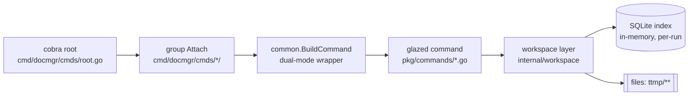
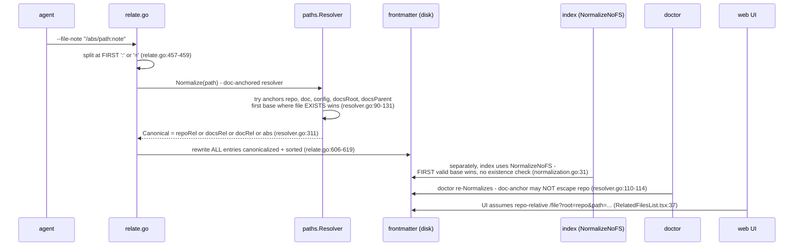

# Improving docmgr for coding agents: analysis, design, and implementation guide

## 1. Executive summary

docmgr is a Go CLI (plus an HTTP API and a React web UI) that gives coding agents and humans a structured place to keep working documentation: per-ticket workspaces under `ttmp/YYYY/MM/DD/<TICKET>--<slug>/`, markdown documents with YAML frontmatter, task checklists, changelogs, a suggested-vocabulary system, an SQLite full-text index, and a `doctor` that validates all of it. It is heavily used in practice: in a sample of 240 historical coding-agent sessions (codex, pi, claude-code) converted to minitrace archives, 139 sessions made **14,166 docmgr tool calls**.

This document does three things:

1. **Explains the system to a newcomer** — every subsystem with file references, diagrams, and the mental model you need before touching the code (sections 3–5).
2. **Grounds the critique in evidence** — four file:line-anchored code reviews plus a quantitative analysis of real agent transcripts using go-minitrace JS query commands (section 6). Headline numbers: `validate frontmatter` fails 22.9% of the time; a nonexistent `ticket show` was guessed 15+ times (46.7% failure); 58% of docmgr failures are followed by an immediate same-verb retry; agents pass `--doc` paths in 7+ different shapes and the most popular shape fails 7–14% of the time.
3. **Proposes a design** (sections 7–9) with decision records and a phased, file-level implementation plan. The core moves: fix the three exit-0 silent failures; make path meaning *explicit* (anchor-schemed related-file paths, one shared resolver) instead of guessed; give the CLI an agent contract (stable JSON, terse success output, remediation-quality errors, aliases for what agents actually type); overhaul doctor so a fresh workspace isn't born failing; close the UI write-path gap; and add an **LLM subsystem inside docmgr** (`docmgr ai …`) so bookkeeping loops (auto-relate, changelog drafting, summary refresh, frontmatter repair) run on a cheap model inside one tool call instead of burning top-level agent turns.

The single sentence that explains the "tricky paths" pain, from the internals review: *the frontmatter stores a bare string, but its meaning is reconstructed at every read by a five-anchor, existence-dependent, CWD-sensitive, symlink-blind guesser whose write side (`relate`), index side (`NormalizeNoFS`), doctor side (`Normalize` + repo containment), and UI side (`root=repo`) are four different algorithms.*

## 2. How to read this document

- **New to docmgr?** Read sections 3–5 in order; they are the onboarding tour. Keep the repo open; every claim has a `file:line` anchor (paths relative to the docmgr repo root).
- **Deciding what to build?** Sections 6–7 are the evidence and the gaps; section 8 the design; section 9 the plan.
- **Reproducing the numbers?** Appendix B lists exact commands; the JS query commands live in this ticket's `scripts/query-commands/` and the raw results in `sources/`.

Repo under review: `docmgr` inside a `go.work` workspace that also contains `glazed` (the CLI framework), `go-go-goja`, `goja-bleve`, `goja-text` (unused by docmgr — see 5.7).

## 3. What docmgr is — the mental model

### 3.1 The problem it solves

Coding agents produce a lot of prose: analyses, design docs, diaries, playbooks. Without structure, that prose rots in scattered `notes.md` files. docmgr imposes a **ticket workspace** convention and gives both agents and humans commands to create, relate, validate, and search those documents. The intended loop:

```
agent starts work on a ticket
  └─ docmgr ticket create-ticket --ticket FOO-123 --title "..."   (scaffold)
      └─ docmgr doc add --ticket FOO-123 --doc-type design-doc ... (documents)
          └─ ... agent edits markdown ...
          └─ docmgr doc relate --doc <path> --file-note "/abs/file.go:why"  (link code ↔ docs)
          └─ docmgr task add / task check                          (progress)
          └─ docmgr changelog update --entry "..."                 (history)
          └─ docmgr doctor --ticket FOO-123                        (validate)
```

The empirical data (section 6) confirms this is exactly what agents do: doctor, relate, changelog, task, add are the top five verbs; search is almost never called.

### 3.2 The on-disk data model

A ticket workspace is a directory tree; **all state is plain files** (the SQLite index is a derived cache, rebuilt per invocation):

```
ttmp/
├── .ttmp.yaml              # optional config (usually at repo root, not here)
├── vocabulary.yaml         # suggested values for Topics/DocType/Intent/Status
├── _templates/, _guidelines/  # scaffolding material (materialized by init)
└── 2026/07/05/DOCMGR-200-...--<long-slug>/
    ├── index.md            # ticket front page; frontmatter carries ticket metadata
    ├── tasks.md            # markdown checkboxes; IDs are positional
    ├── changelog.md        # dated sections, appended by `changelog update`
    ├── design-doc/01-*.md  # documents, one subdir per DocType, numeric prefixes
    ├── reference/01-*.md
    ├── playbooks/ scripts/ sources/ various/ archive/ .meta/
```

Every document carries YAML frontmatter defined by `models.Document` (`pkg/models/document.go:69-83`): `Title`, `Ticket`, `Status`, `Topics`, `DocType`, `Intent`, `Owners`, `RelatedFiles`, `ExternalSources`, `Summary`, `LastUpdated`, plus skill-oriented `WhatFor`/`WhenToUse`. Three facts about this struct drive a lot of downstream behavior:

- **No `omitempty`**: any rewrite materializes all 13 keys, including `LastUpdated: 0001-01-01T00:00:00Z` if unset (verified empirically; document.go:69-83).
- **`RelatedFiles`** entries are `{Path, Note}` pairs whose YAML unmarshaller accepts legacy plain strings and mappings, and **silently drops** malformed entries (document.go:321-359 — `continue` at :341).
- **`Status`/`DocType`/`Intent`/`Topics` are free-form strings**; the vocabulary is only consulted by doctor as warnings, never at write time (`meta update` happily sets `Status: banana`).

### 3.3 The four ways in

| Surface | Entry point | Who uses it |
|---|---|---|
| CLI | `cmd/docmgr/main.go` → `cmd/docmgr/cmds/root.go` | agents (99% of real usage), humans |
| HTTP API | `docmgr api serve` → `internal/httpapi/server.go:37-55` | the web UI |
| Web UI | `ui/` React SPA, embedded via `internal/web` | humans browsing |
| Embedded help | `pkg/doc/*.md` (17 topics, ~9,300 lines) via glazed help | agents (`docmgr help <topic>`) |

## 4. Current-state architecture — subsystem tour

### 4.1 Command architecture (glazed dual-mode)

Every command's logic lives in `pkg/commands/*.go` as a **glazed command**; cobra wiring lives in `cmd/docmgr/cmds/<group>/*.go`, each group exposing `Attach(root)` called from `cmd/docmgr/cmds/root.go:26-100`. The wrapper `cmd/docmgr/cmds/common/common.go:13-39` gives every command *dual mode*: human markdown by default, structured output with `--with-glaze-output` (default format JSON — common.go:20). This is genuinely agent-friendly: any listing command can emit JSON/CSV with field selection for free.



The full command inventory (30+ verbs across `ticket`, `doc`, `task`, `changelog`, `meta`, `vocab`, `skill`, `import`, `ignore`, `config`, `template`, `validate`, `api`, workspace lifecycle) is in the CLI review; the notable structural facts:

- **The same operation is spelled 2–4 ways**: `doc list` = `doc docs` = `list docs`; `ticket tickets` = `ticket list` = `list tickets`; `search` = `doc search`; and all five workspace verbs (`init`, `status`, `doctor`, `configure`, `export-sqlite`) are registered both at root and under `workspace` (`cmd/docmgr/cmds/workspace/workspace.go:22-44`).
- **Naming stutter**: `ticket create-ticket`, `ticket rename-ticket` (`pkg/commands/create_ticket.go:53`, `rename_ticket.go:37`).
- **Dual-mode is inconsistent**: `task add`/`uncheck`/`remove`, `doc move`, `ticket move`/`rename-ticket`, `export-sqlite` are human-only; their siblings support JSON.
- **Dead code**: `pkg/commands/list.go` defines `NewListCommand` that is never registered.

### 4.2 Workspace discovery and configuration

All root resolution lives in `internal/workspace/config.go`:

1. `DOCMGR_CONFIG` env → config path (config.go:86-95); else walk up from CWD for `.ttmp.yaml` (:97-113).
2. Explicit `--root` (any value other than the literal default `"ttmp"`) wins (:193-206) — note the magic-value trap: a user passing `--root ttmp` explicitly is indistinguishable from the default (`internal/workspace/workspace.go:52-55`).
3. Else config `root:` (relative → config dir) (:210-231); else `<gitRoot>/ttmp` (:239-246); else `<cwd>/ttmp` (:248-256).
4. Malformed `.ttmp.yaml` prints a warning and silently falls back (:144-149) — a YAML typo redirects the whole workspace.

`RepoRoot` detection (`FindRepositoryRoot`, config.go:297-323) is git root, else `go.mod`, else a directory containing `doc/` (a legacy marker), else CWD. The paths resolver has a *second, subtly different* repo detector (`walkForRepo`: `.git` or `go.mod`, `internal/paths/resolver.go:385-401`). **`go.work` is never consulted**, which matters for cross-repo related files (see 4.4).

### 4.3 The SQLite index and search

Every invocation rebuilds an in-memory SQLite index of the workspace (`internal/workspace/index_builder.go`): tables `docs`, `doc_topics`, `doc_owners`, `related_files` (`sqlite_schema.go:77-127`), plus FTS5 `docs_fts` when compiled with `-tags sqlite_fts5`. Full-text search (`docmgr doc search`) runs `MATCH` + `bm25()` (`query_docs_sql.go:129-145`).

The trap: **a plain `go build ./cmd/docmgr` produces a binary whose flagship search command hard-fails** — `Error: fts5 not available (docs_fts missing)` (`query_docs.go:36-37`) — because only the Makefile passes `-tags "sqlite_fts5,embed"` (Makefile:30,38,66). There is no LIKE fallback and the error doesn't mention build tags. CI compounds this: `.github/workflows/push.yml:30` runs `go test ./...` untagged, so the production search path is never tested in CI.

Search-adjacent facts: snippets are byte-sliced (UTF-8 unsafe) literal-substring extractions (`internal/searchsvc/snippet.go`); `--created-since` uses file ModTime as creation time (`search.go:203-208`); `doc search --files` (a bool!) switches the command into a git/ripgrep file-suggestion mode that duplicates `doc relate --suggest` — one letter away from `--file` (string) which does reverse lookup.

### 4.4 The paths subsystem — life of a related file

This is the heart of the "tricky frontmatter paths" complaint. The pipeline for `docmgr doc relate --doc <D> --file-note "<P>:<note>"`:



`NormalizedPath` holds **six representations** of one string (`Original, OriginalClean, Canonical, Abs, RepoRelative, DocsRelative, DocRelative` + `Anchor`, `Exists` — resolver.go:39-49). Concrete failure modes, each verified:

1. **Absolute paths are never stat'd**: the absolute-input short-circuit hard-codes `Exists=true` (resolver.go:86-88). Doctor can never flag a deleted absolutely-referenced file; `relate` accepts nonexistent paths silently.
2. **Cross-repo self-contradiction**: relating a file in a sibling go.work repo stores `../../../../../../glazed/pkg/foo.go` (doc-relative, `relativeAllowParents` resolver.go:305-311). Doctor then re-resolves it, but the doc anchor **must stay inside the repo** (resolver.go:110-114), so every anchor fails → `missing_related_file` warning **for a file relate itself just wrote**. The UI 403s it (`internal/httpapi/path_safety.go:48-53`).
3. **Write-time vs index-time divergence**: `Normalize` (existence-dependent anchor choice) vs `NormalizeNoFS` (first-valid-base) can pick different anchors for the same string, so index keys and stored canonical forms disagree; reverse lookup falls back to a `LIKE '%/basename'` hack that is disabled when the query contains `/` (query_docs_sql.go:274-299).
4. **CWD sensitivity**: a workspace-level resolver built without `DocPath` silently uses the process CWD as the "doc" anchor (resolver.go:53, 326-336); root/repo detection also starts at CWD — same command, different directory, different stored paths.
5. **Fuzzy matching is loose**: `MatchPaths` lowercases and matches on substring containment between any two representations (resolver.go:481-517) — `--file api.go` matches `chatapi.go`.
6. **Windows/URL hostility**: `--file-note` splits at the first `:` or `=` anywhere (relate.go:457-459); `cleanInput` converts all backslashes to the OS separator (resolver.go:338-348).
7. **Silent drop**: `--file-note "no-colon-here"` is skipped with exit 0 and "no changes requested" (relate.go:460-462).

Section 6 shows agents feel all of this: the `ttmp/ttmp/` double-join in real errors, 7+ path shapes for `--doc`, 96 file-not-found failures, `.../..`-chain frontmatter entries rendered as garbage in `ticket graph`.

### 4.5 Doctor and diagnostics

Doctor (`pkg/commands/doctor.go`) is the most-called verb in real usage (3,330 calls in the sample). It validates ticket workspaces against ~12 checks (missing index, stale, invalid frontmatter, unknown vocabulary values, missing related files, numeric prefixes…). Structural problems, all evidence-anchored:

- **Most checks only run on `index.md`** — RelatedFiles, vocabulary, staleness are validated inside `if idx := bucket.IndexByPath[indexPath]` (doctor.go:411-630). Design docs' RelatedFiles are never checked, though `relate --doc` writes them.
- **Fresh workspace fails its own doctor**: `init` doesn't seed vocabulary by default, but `create-ticket` writes `Intent: long-term`, `DocType: index`, `Status: active` → wall of `unknown_*` warnings out of the box (`LoadVocabulary` returns empty vocab when the file is missing, `pkg/commands/vocabulary.go:26-33`).
- **Issue numbering is broken**: every issue renders as `1)` because the counter resets per taxonomy (`pkg/diagnostics/render/render.go:19` vs `pkg/diagnostics/docmgr/adapter.go:99-119`).
- **Suggested remediations don't work**: doctor prints `docmgr vocab add --category doctype --slug index` — `doctype` is not an accepted category (`pkg/commands/vocab_add.go:149-159`) and the required `--description` is missing. Copy-pasting the tool's own suggestion fails twice.
- **`sources/` is always validated**: imported verbatim files get `invalid_frontmatter` errors and prefix warnings; `is_sources_path` is computed and stored but **never filtered on** (dead column — `skip_policy.go:50`, `query_docs_sql.go:32-40`).
- **Output volume**: `doctor --all` on this repo emits 112 KB / 1,320 lines; no `--limit`, no summary-first mode.

`validate frontmatter` overlaps doctor as a second single-file validator with different output and an `--auto-fix` mode; empirically it has the worst failure rate of any real verb (22.9%, section 6).

### 4.6 Tasks, changelog, meta

- `tasks.md` is parsed positionally: **IDs are recomputed on every parse** (`internal/tasksmd/tasksmd.go:84-97`), so `task check --id 3` targets a different task after any insertion above. Agents were observed inventing hierarchical IDs (`--id F2.5.1`) that fail `strconv.Atoi`.
- `changelog update` without `--entry` appends an empty dated heading and reports success (`pkg/commands/changelog.go:65`).
- `meta update` prints per-file errors but **exits 0** (`pkg/commands/meta_update.go:297-305`).
- Every task/changelog mutation prints an unconditional multi-line reminder nag (`pkg/commands/tasks.go:380,487,653,718`; `changelog.go:557`), plus every command prints a 3-line `Docs root:/Config:/Vocabulary:` banner of absolute paths (~360 chars of noise per call, e.g. `meta_update.go:288-294`).

### 4.7 HTTP API and web UI

`docmgr api serve` (raw cobra, self-flagged legacy — `cmd/docmgr/cmds/api/serve.go:1`) serves `/api/v1/*` (20 routes, `internal/httpapi/server.go:37-55`) plus the embedded SPA (`internal/web/spa.go`, built by a Dagger pipeline into `go:embed`). Reads go through an in-memory index snapshot with **no file watching** — data is stale until `POST /index/refresh`.

The UI (React 19 + RTK Query, `ui/src/services/docmgrApi.ts` with 18 endpoints) is a polished **read-mostly browser**: tickets/topics/recent browsing, a genuinely excellent search page (keyboard model, URL deep links, FTS highlighting), doc viewer, file viewer, ticket tabs (overview/documents/tasks/graph/changelog). Exactly **two write operations** exist (task check, task add — hardcoded to the TODO section, `TicketTasksTab.tsx:107`). Everything else — doc creation, frontmatter/status edits, relate, changelog, doctor, vocab — is CLI-only. Rendering gaps: mermaid blocks in doc bodies are **not** rendered (only the graph tab uses `MermaidDiagram`; `ui/src/components/MarkdownBlock.tsx:12-16` has no component overrides), relative links between docs break (SPA navigates to nonexistent routes), relative images can't load (no raw-asset endpoint), no heading anchors/TOC for long docs. Paper cuts: error messages hardcode the dev port 3001 (`WorkspaceLayout.tsx:69`) while the embedded server defaults to 8787 (`serve.go:73`); `StatusBadge` is copy-pasted five times; changelog tab is a stub link (`TicketChangelogTab.tsx:9`).

### 4.8 Peripheral subsystems

| Subsystem | State | Evidence |
|---|---|---|
| **Skills** (`internal/skills`, 1,447 LOC; `skill list/show/export/import`) | Active, tested, documented; packages docs into Agent-Skills format | last commits 2026-01-14; scenario `20-skills-smoke.sh` |
| **Templates** (`internal/templates`; embedded doc-type templates + guidelines) | Stable, in critical path of `init`/`add` | `embedded/_templates/*.md`, 11 doc types |
| **Verb output templates** (`.templ` postfix renderers for 9 verbs + `--print-template-schema`) | Niche power feature, working | `internal/templates/verb_output.go`, `examples/verb-templates/` (11 samples) |
| **scenariolog** (separate module; SQLite flight recorder for the scenario suite) | Maintained-on-demand; not in `go.work` (needs `GOWORK=off`), glazed pinned at v1.0.5 vs main v1.3.6 | `scenariolog/go.mod`; `test-scenarios/testing-doc-manager/run-all.sh:30-37` |
| **Test scenarios** (22 bash E2E scenarios) | Active but **not in CI** | `test-scenarios/testing-doc-manager/` |
| **Embedded help** (17 topics, ~9,300 lines) | Broad and good | `pkg/doc/` |
| **`test-api.sh`** | Dead — curls routes that no longer exist (`/api/list` vs `/api/v1/*`), wrong port, foreign ticket ID | last touched 2025-11-07 |
| **bleve/goja siblings** | **Zero integration** — docmgr's search is SQLite FTS5; the sibling repos are docmgr *consumers*, not dependencies | grep across go.mod/internal: no hits |
| **README/AGENT.md/CONTRIBUTING** | Materially stale: broken code fence in README quick start; AGENT.md describes a different repo layout (`ttmp/YYYY-MM-DD/`, `doc/`, bun+templ UI); CONTRIBUTING points at nonexistent files and obsolete glazed APIs | README.md:130-160; AGENT.md; CONTRIBUTING.md |

## 5. Where state lives (and duplicates)

An intern needs this table before touching anything, because several bugs are "two copies disagree":

| Fact | Copy 1 | Copy 2 | Copy 3 | Reconciliation |
|---|---|---|---|---|
| Ticket ID | frontmatter `Ticket:` | directory name `<ID>--slug` | — | 3 independent heuristics (`index_builder.go:316-344`, `doctor.go:772-815`, `doctor.go:843-852`) |
| Related file meaning | frontmatter path string | index `related_files.anchor` (ephemeral) | — | anchor is *not* persisted in the file |
| Ticket progress | index.md `Status` | tasks.md checkboxes | changelog.md | nothing syncs them; doctor checks none of the cross-consistency |
| External sources | frontmatter `[]string` (`local:name`) | `.meta/sources.yaml` (rich struct) | — | `.meta/` excluded from index → rich copy invisible |
| Docs root | `--root` flag | `.ttmp.yaml` | git root/ CWD fallback | magic literal `"ttmp"` sentinel (workspace.go:52-55) |
| Repo root | `workspace.FindRepositoryRoot` (git → go.mod → `doc/` dir!) | `paths.walkForRepo` (git → go.mod) | — | two different definitions |

## 6. Empirical evidence: how agents actually use docmgr

### 6.1 Methodology

We mined the three native transcript stores on this machine (`~/.codex/sessions`, `~/.pi/agent/sessions`, `~/.claude/projects`) with **go-minitrace**:

1. **Narrowing** (raw grep, because ~2,000 candidate sessions / several GB is too much to convert wholesale): 1,017 codex, 825 pi, and 145 claude session files contain real docmgr subcommand invocations (`scripts/01-docmgr-command-frequency.sh`, `scripts/02-docmgr-error-patterns.sh`).
2. **Sampling + conversion** (`scripts/03-stage-and-convert.sh`): top-50 sessions per store by docmgr-hit count plus every 20th of the remainder, symlink-staged into store-shaped trees, converted with `go-minitrace convert codex|pi|claude-code` → 98 + 88 + 54 = **240 sessions, ~1.1 GB of minitrace archives**.
3. **Analysis** as reusable go-minitrace **JS query commands** (`scripts/query-commands/docmgr/{probe,usage,paths,volume}.js`) over the normalized SQLite tables (`sessions`, `tool_calls` with `command`, `success`, `exit_code`, `error`, `result`, `position_in_session`). Raw results: `sources/minitrace-*.json`.

Caveats: `success`/`exit_code` semantics differ per adapter; the claude sample is small (17 sessions with docmgr activity); rates are most meaningful within a framework. Prompt-echo matters: raw grep counts `doc search` 169k times in codex payloads, but only 22 *executed* `doc search` tool calls exist in the converted sample — never trust grep counts of transcripts.

### 6.2 Volume and shape of usage

139 sessions made 14,166 docmgr tool calls (pi 8,049 / 74 sessions; codex 5,819 / 48; claude-code 298 / 17). Aggregated per-verb (calls ≥ 100), from `sources/minitrace-command-freq.json`:

| invocation | calls | failures | rate % |
|---|---|---|---|
| doctor | 3,330 | 35 | 1.1 |
| doc relate | 2,487 | 91 | 3.7 |
| changelog update | 1,861 | 19 | 1.0 |
| task add | 1,519 | 28 | 1.8 |
| doc add | 1,474 | 44 | 3.0 |
| task check | 1,049 | 10 | 1.0 |
| ticket create-ticket | 692 | 12 | 1.7 |
| vocab add | 665 | 36 | 5.4 |
| ticket list | 530 | 19 | 3.6 |
| **validate frontmatter** | **494** | **113** | **22.9** |
| doc list | 375 | 4 | 1.1 |
| status | 370 | 13 | 3.5 |
| ticket close | 161 | 3 | 1.9 |
| doc search | 22 | 2 | 9.1 |

Readings:

- **docmgr is a bookkeeping tool in practice.** The top six verbs are all writes/validation. `doc search` — the feature with the most engineering behind it (FTS5, snippets, facets, a dedicated UI page) — is nearly unused by agents (22 calls), presumably because agents already have grep and their own file context.
- **`validate frontmatter` is broken-by-usage**: 22.9% failure over 494 calls, and it's also the #1 same-verb retry sink (78 retries). Agents reach for it when frontmatter parse errors block other commands, then fight it.
- **Agents guess commands that don't exist**: `ticket show` (15 calls, 46.7% fail), `ticket create` (7 calls, 28.6% fail — they mean `create-ticket`), plus `--plain` and `--ticket` on the `ticket` group (54 unknown-flag failures). What agents guess is a free spec for aliases.

### 6.3 Failure taxonomy

From `sources/minitrace-error-summary.json` (classified failed calls):

| error class | count | representative evidence |
|---|---|---|
| file-not-found | 96 | `Error: open /home/manuel/.../esp32-s3-m5/ttmp/ttmp/2026/01/20/0048-...` — note the **`ttmp/ttmp/` double-join**: agent passed a docs-root-relative path, docmgr joined it to the root again |
| other (unclassified) | 80 | mostly `Error: expected exactly 1 doc for --doc "<path>"` wrapped in other output |
| frontmatter-parse | 57 | `Error: document has invalid frontmatter (fix before relating files): ...` |
| unknown-flag | 54 | `unknown flag: --ticket` (on `ticket` group), `--plain` |
| docs-root confusion | 37 | `expected exactly 1 doc for --doc "ttmp/2026/..."` |
| ticket-not-found | 27 | agents pass the **directory slug** (`0055-MQJS-SERVICE-COMPONENT--reusable-...`) instead of the ticket ID |
| ticket-ambiguous | 18 | `ambiguous ticket index doc for EVT-STREAM-010 (got 2)` — duplicated tickets across dates |
| invalid --id | 5 | `strconv.Atoi: parsing "F2.5.1"` — agents invent hierarchical task IDs |

And the **retry tax** (`sources/minitrace-retry-chains.json`): 380 failure→next-docmgr-call chains; **58% retried the same verb immediately**. Every one of those is a wasted expensive-model turn that a better error message or a more forgiving resolver would have prevented.

### 6.4 Path shapes: measuring the frontmatter-paths pain

`scripts/query-commands/docmgr/paths.js` classifies every `--doc` and `--file-note` argument in the corpus:

**`--doc` (n≈2,870):** agents use at least 7 shapes. The two most popular are also the failure-prone ones:

| shape | example | uses | failure % |
|---|---|---|---|
| `ttmp/`-prefixed | `ttmp/2026/02/08/VM-011-.../analysis/01-x.md` | 1,107 (pi 715 / codex 392) | 7.6 / 14.0 |
| bare-relative | `reference/01-diary.md`, `esp32-s3-m5/ttmp/...` | 906 | 3.9–16.2 |
| absolute-with-ttmp | `/home/.../ttmp/2026/...` | 653 | **2.5–5.6 (best)** |
| docs-root-relative (date) | `2026/01/20/0048-.../design-doc/01-x.md` | 170 | **11.1–18.0 (worst)** |
| dot-relative / parent-relative / other | | ~30 | mixed |

**`--file-note` (n≈15,000 values):** dominated by absolute paths (9,353 uses, 3.2% fail); bare repo-relative 3,011; and 31 `../../..`-chain cross-repo uses — the exact pattern section 4.4 shows to be self-contradictory.

Conclusion: **agents cannot infer the intended path dialect**, they oscillate between five of them, and the empirically safest answer ("always absolute") is undocumented and contradicts what `relate` then stores.

### 6.5 Context cost of docmgr output

`scripts/query-commands/docmgr/volume.js` sums `length(tool_calls.result)` per verb (harness truncation caps observed at ~10 KB):

| invocation | calls | avg bytes | total |
|---|---|---|---|
| ticket create-ticket | 508 | **3,106** | 1.50 MB |
| doctor | 1,999 | 758 | 1.44 MB |
| doc add | 774 | 1,704 | 1.26 MB |
| task list | 643 | 1,725 | 1.06 MB |
| ticket list | 390 | 2,487 | 0.93 MB |
| doc relate | 1,498 | 564 | 0.81 MB |

Across the sample docmgr injected **~10 MB into agent contexts**. `ticket create-ticket`'s 3.1 KB average is the created-directories banner (9 directories + 4 files, each as a full path bullet). Multiplied by per-token costs of frontier models, terse output is a real feature.

### 6.6 What agents never use

Cross-referencing the command inventory with the corpus: `skill list/show/export/import`, `ticket graph`, `doc renumber`, `doc layout-fix`, `doc move`, `ticket move`, `export-sqlite`, `template validate`, `ignore explain`, verb `.templ` templates — **zero or near-zero calls** in 139 sessions. These aren't necessarily bad features (some are human-facing), but they justify the "functionalities we barely use" instinct and set the deprecation agenda (section 8.8).

## 7. Gap analysis

Mapping evidence → defect classes, ranked by (agent impact × frequency):

| # | Gap | Evidence | Class |
|---|---|---|---|
| G1 | Silent failures exit 0 (relate file-note, meta update, empty changelog) | relate.go:460-462; meta_update.go:297-305; changelog.go:65. **Live-reproduced while writing this doc**: `--file-note` values are comma-split by glazed stringList parsing, so a note containing "(sections 4.4, 8.1)" was truncated at the comma and the remainder fragment — having no `:` — was *silently dropped*, exit 0. Notes with commas are common English; `--file-note` should be a repeatable plain string, not a comma-list | correctness |
| G2 | Path meaning is guessed, four subsystems disagree; cross-repo unrepresentable; absolute never stat'd | §4.4; 96 file-not-found; `ttmp/ttmp/`; 7+ shapes at 7–18% failure | design flaw |
| G3 | `validate frontmatter` 22.9% failure + #1 retry sink; overlaps doctor | §6.2/6.3 | UX/correctness |
| G4 | Agents guess verbs/flags that don't exist (`ticket show`, `ticket create`, `--plain`) | 54 unknown-flag + 22 guessed-verb failures | discoverability |
| G5 | Doctor: index-only checks, self-failing fresh workspace, broken numbering, wrong remediation, sources noise, 112 KB output | §4.5 | validation quality |
| G6 | Output verbosity: banners, nags, 3.1 KB create-ticket, ~10 MB corpus-wide | §6.5 | context economy |
| G7 | fts5 build-tag trap; CI never tests FTS or scenarios | §4.3, push.yml:30 | build/test |
| G8 | tasks.md positional IDs unstable; agents invent IDs | tasksmd.go:84-97; `F2.5.1` errors | data model |
| G9 | UI read-only for everything that matters; mermaid/links/images broken in doc bodies; stale index | §4.7 | UI parity |
| G10 | Duplicate command spellings inflate surface; dead code; dead flags | §4.1 | surface hygiene |
| G11 | Bookkeeping loops burn top-level agent turns (relate → doctor → fix → doctor…) | 58% same-verb retries; doctor 3,330 calls | workflow cost |
| G12 | Docs drift (README/AGENT.md/CONTRIBUTING) misleads both agents and contributors | §4.8 | docs |

## 8. Proposed design

### 8.1 D1 — Explicit path anchors and one resolver

**Decision record: persist the anchor in the frontmatter path.**

- **Context**: RelatedFile paths are bare strings; meaning (repo-relative? doc-relative? cross-repo?) is reconstructed by 4 divergent algorithms; cross-repo files are unrepresentable except as brittle `../` chains that doctor/UI reject (§4.4).
- **Options**: (a) keep bare strings, harmonize the resolvers; (b) always store absolute paths; (c) prefix an explicit anchor scheme; (d) store structured `{anchor, path}` YAML.
- **Decision**: **(c)** — scheme-prefixed strings: `repo://pkg/foo.go`, `ws://glazed/pkg/parameters/fields.go`, `docs://2026/07/05/TICKET/design/01.md`, `doc://../reference/01-diary.md`, `abs:///home/...` (escape hatch). Legacy bare strings remain readable via today's resolver, and `doctor --fix` migrates them by stamping the anchor `Normalize` currently infers.
- **Rationale**: keeps YAML human-readable and diff-friendly (unlike d); portable across machines (unlike b — the corpus shows absolute paths are reliable *to type* but pin the workspace to one home directory); removes guessing (unlike a, which keeps ambiguity for old and new entries alike). `ws://` gets its meaning from a **go.work-aware workspace root** (new: teach `FindRepositoryRoot`/`walkForRepo` to detect `go.work` and name member repos).
- **Consequences**: one new `internal/paths` parse step; `relate` writes anchored paths; doctor/UI/index resolve via a single `Resolve(anchored) → abs` function; `MatchPaths` fuzzy layer shrinks to suffix matching on the resolved form. `Exists` becomes an honest `os.Stat` for every anchor including `abs://`.
- **Status**: proposed.

Pseudocode for the unified resolver:

```
parseAnchored(s):
    if s matches "<scheme>://<rest>"  -> (scheme, rest)
    else                              -> (legacy, s)          # old files

resolve(scheme, rest, ctx {repoRoot, wsRoot, docsRoot, docDir}):
    repo  -> join(repoRoot, rest)
    ws    -> join(wsRoot, rest)          # wsRoot = dir of go.work, else repoRoot
    docs  -> join(docsRoot, rest)
    doc   -> join(docDir, rest)          # MAY escape repo; that's the point
    abs   -> rest
    legacy-> today's Normalize(), then RECOMMEND migration (doctor hint)

exists = os.Stat(resolved)              # no special cases
```

Write-side change in `relate` (`canonicalizeWithResolver`, relate.go:653-672): choose the *tightest containing* anchor — inside repo → `repo://`; inside another go.work member → `ws://`; inside docs root → `docs://`; else `abs://`. Never emit repo-escaping `doc://../..` chains.

### 8.2 D2 — The agent CLI contract

A one-page contract, enforced by tests, that every verb obeys:

1. **Exit codes mean something**: 0 = success, 1 = user error, 2 = internal error. Fixes G1: malformed `--file-note` → error naming the value; `meta update` with any error row → exit 1; `changelog update` requires non-empty `--entry`.
2. **Terse success, informative failure**. Success output ≤ 5 lines by default (see D4). Failure output = one-line cause + one *valid* remediation command. Error strings get a `did you mean` layer for unknown verbs/flags (cobra suggestions are already close; extend with the corpus-derived alias table).
3. **Alias what agents guess** (G4): `ticket create` → `create-ticket`; `ticket show <ID>` → filtered `ticket list`; `ticket rename` → `rename-ticket`; accept `--ticket` on the `ticket` group parent as a no-op routing flag or reject with the exact right command; make `ticket list` canonical (`tickets` the alias) to match `doc list`.
4. **Ticket/doc reference forgiveness**: `--ticket` accepts ID, ID prefix (unique), or directory slug (the 27 ticket-not-found failures show agents paste slugs); `--doc` accepts any of the anchored forms plus absolute, resolved through one function shared with D1 (kills the `ttmp/ttmp/` join and `expected exactly 1 doc` classes — ~130 observed failures).
5. **Uniform dual-mode**: add `WithDualMode` + glaze output to `task add/uncheck/remove`, `doc move`, `ticket move/rename`, `export-sqlite`; migrate `api serve` flags to glazed fields. Consider `DOCMGR_OUTPUT=json` env for agents that always want structured output.
6. **One error print**: `SilenceErrors` on root (main.go already prints).

**Decision record: forgiving references over strict IDs.** Context: 27+18 not-found/ambiguous failures; agents paste whatever string is nearest in context. Options: strict (status quo), fuzzy-always, explicit-forgiving (exact → unique-prefix → slug → error listing candidates). Decision: explicit-forgiving with deterministic precedence and a candidate list on ambiguity. Rationale: deterministic (unlike fuzzy), cuts the observed failure class, costs one indexed lookup. Status: proposed.

### 8.3 D3 — Doctor overhaul

- Run RelatedFiles/vocabulary/staleness checks on **all** docs (move the index-only block doctor.go:568-630 into the per-doc loop at :633).
- **Skip `sources/` by default** for frontmatter/prefix checks (wire the dead `is_sources_path` column into `DocQueryOptions`).
- **Vocabulary bootstrap**: seed vocabulary on `init` by default; treat built-ins (`index`, `long-term`, `active`, `complete`, `archived`) as always-known; when no vocabulary file exists emit one info line, not N warnings.
- Fix numbering (pass a running counter through `render.RenderToText`) and remediation commands (valid category + `--description` placeholder).
- **`doctor --fix`**: absorb `validate frontmatter --auto-fix` (G3) plus safe fixes — anchor migration (D1), numeric-prefix renames, vocabulary additions with `--yes`. `validate frontmatter` becomes an alias for `doctor --doc <p> --fix`; its 22.9% failure rate mostly reflects agents reaching for a fixer and finding a validator.
- **Summary-first output**: default to per-ticket rollup lines + `--details` for the full 112 KB report; `--fail-on error|warning` already exists and keeps CI semantics.

### 8.4 D4 — Output diet (context economy)

- Replace the 3-line root/config/vocabulary banner with nothing on success (available under `--verbose`); one-line summaries for mutations: `related 2 files to design-doc/01-x.md (1 new, 1 updated)`.
- `ticket create-ticket`: print the ticket path + doc paths only (`created DOCMGR-200-... (9 dirs, 4 files) at ttmp/2026/07/05/...`).
- Reminder nags: print once per process only when stderr is a TTY, or behind `--coach`; agents get a machine-readable `hints` field in JSON mode instead.
- Target: median success output ≤ 200 bytes (vs 564–3,106 today) — a ~10× reduction on the ~10 MB/sample context bill.

### 8.5 D5 — Stable task IDs

Positional IDs break on insertion (G8). Add stable short IDs as invisible markers: `- [ ] Fix resolver <!-- t:a3f2 -->`, generated at `task add`, tolerated when absent (fallback to position, with doctor hint to migrate). `task check --id` accepts the stable ID or position; non-integer input error explains the format and prints the current task table (agents inventing `F2.5.1` show they never saw the actual IDs).

### 8.6 D6 — UI: write-path parity and rendering fidelity

Priority order from the UI review (§4.7):

1. Mermaid in doc bodies (route ```mermaid fences in `MarkdownBlock` to the existing `MermaidDiagram`) — one-file change, big payoff for docmgr's diagram-heavy docs.
2. Link/image interception: relative `.md` → `/doc?path=…`; repo files → `/file?path=…`; new raw-asset endpoint reusing `resolveFileWithin`.
3. Write endpoints wrapping existing command logic: `POST /docs/meta` (meta update + status transitions), `POST /docs/relate`, `GET /tickets/changelog` + `POST` append, `GET /workspace/doctor`; UI affordances on the existing pages (status dropdown, relate action in files-search results, health page reusing `DiagnosticCard`).
4. Hygiene: shared `StatusBadge`, correct port hint, debounce tickets FTS input, auto-refresh index after the UI's own writes.

### 8.7 D7 — LLM functionality inside docmgr (`docmgr ai`)

**Motivation (user-requested):** the corpus shows agents run bookkeeping *loops*: relate → doctor → fix → doctor; write changelog; refresh summaries — each step a top-level tool call on an expensive model with docmgr output re-read into a giant context. Many of these are fuzzy-but-mechanical: exactly what a cheap model with a narrow prompt does well. Moving them inside docmgr turns N agent turns into one tool call.

**Decision record: where do LLM calls live?**

- **Context**: reduce top-level harness loops (G11).
- **Options**: (a) status quo — the top-level agent does everything; (b) docmgr shells out to helper CLIs (`pinocchio`); (c) docmgr embeds an LLM client behind a provider interface, configured via env; (d) docmgr exposes an MCP server so the harness delegates.
- **Decision**: **(c)** — an `internal/ai` package with a minimal chat-completion interface (Anthropic + OpenAI-compatible + local endpoint), model/keys from `DOCMGR_AI_MODEL` / standard `ANTHROPIC_API_KEY`/`OPENAI_API_KEY` env or `.ttmp.yaml` `ai:` block. Every `ai` verb **degrades gracefully**: no key → clear error naming the env var, exit 2, never blocks non-AI verbs.
- **Rationale**: (b) adds a fragile process dependency and parsing layer; (d) is complementary but doesn't help codex/pi/CLI-only harnesses; (c) matches how the go-go-golems ecosystem (geppetto) already talks to providers and keeps docmgr self-contained. Costs stay bounded: all designed verbs are single-shot prompts over bounded inputs (diffs, doc bodies), no agentic loops inside docmgr.
- **Consequences**: docmgr gains a network dependency for `ai` verbs only; deterministic verbs stay deterministic; scenario suite mocks the provider with a replay transport.
- **Status**: proposed.

**Verb set (each: input → prompt → structured output → deterministic apply step):**

```
docmgr ai relate --ticket T [--since <ref>]
    input: git diff --name-only + doc list + existing RelatedFiles
    llm:   rank candidate (file, doc, note) triples
    apply: docmgr doc relate ... per accepted triple (with --yes / --review)

docmgr ai changelog --ticket T [--since <ref>]
    input: git log/diff since last changelog entry + tasks.md deltas
    llm:   draft a dated entry (+file-notes)
    apply: changelog update --entry <draft>

docmgr ai summarize --doc <p> | --ticket T
    input: doc body (or all doc summaries for the ticket index)
    llm:   1-3 sentence Summary
    apply: meta update --field Summary

docmgr ai fix-frontmatter --doc <p>
    input: raw broken frontmatter + parse error + schema
    llm:   corrected YAML (validated by re-parsing before write)
    apply: atomic rewrite; refuses if body changed

docmgr ai review --ticket T          # doc QA
    input: docs + tasks + changelog
    llm:   inconsistencies (stale claims, docs contradicting code paths, missing docs)
    apply: none — report only (feeds doctor as 'advisory' severity)

docmgr ai vocab --suggest            # from existing free-form values
```

Guard rails: `--dry-run` default for anything that writes (explicit `--yes` to apply, mirroring the existing suggest/apply split in `doc relate --suggest/--apply-suggestions`); prompts and raw responses logged under the ticket's `.meta/ai/` for auditability; token caps per call; no repo file contents sent except explicitly-included diffs/doc bodies.

Why this beats harness loops, quantified: an `ai relate` pass replaces the observed pattern of 3–8 top-level calls (`doc search --files` / `git status` / repeated `doc relate`) at frontier-model prices with one docmgr call using a model ~20× cheaper, and its output is ~200 bytes of applied-changes summary instead of intermediate listings.

### 8.8 D8 — Deprecations and surface pruning

- Delete: `pkg/commands/list.go` (dead), `test-api.sh` (routes don't exist), `--files` tombstone flags on `relate`/`changelog` (let cobra say unknown flag).
- Collapse spellings: keep `docmgr list docs|tickets` + group-local `list`; demote the rest to hidden aliases; drop the `workspace` duplicate registration (keep root-level).
- Merge `validate frontmatter` into `doctor --doc --fix` (alias retained).
- Demote `ticket move`, `export-sqlite`, `template validate` to a `dev`/hidden namespace; regenerate `.codex/skills` via `docmgr skill export` instead of hand-copied snapshots.
- Fix `ignore explain` (implement bare run or register glaze-first).
- Docs refresh: README quick-start fence + feature list (API/UI/skills/import/graph); AGENT.md rewritten for this repo; CONTRIBUTING points at `pkg/doc/docmgr-how-to-add-cli-verbs.md`.

## 9. Phased implementation plan (file-level)

### Phase 0 — Stop the bleeding (1–2 days, no design risk)

| change | files |
|---|---|
| Error on malformed `--file-note`; exit 1 | `pkg/commands/relate.go:457-462` |
| `meta update` exit 1 on any error row | `pkg/commands/meta_update.go:297-305` |
| Require non-empty `--entry` | `pkg/commands/changelog.go:65` |
| fts5 error mentions build tags; or LIKE fallback | `internal/workspace/query_docs.go:36-37`, `sqlite_schema.go:175-200` |
| Fix `ignore explain` bare mode | `pkg/commands/ignore_explain.go`, `cmd/docmgr/cmds/ignorecmd/explain.go:16-18` |
| Doctor numbering + valid remediation commands | `pkg/diagnostics/render/render.go:19`, `docmgrrules/vocabulary_rule.go:38`, `pkg/commands/vocab_add.go:149-159` |
| Stat absolute paths (drop `Exists=true` short-circuit) | `internal/paths/resolver.go:86-88` |
| `SilenceErrors` on root | `cmd/docmgr/cmds/root.go:27` |
| Delete dead code/files | `pkg/commands/list.go`, `test-api.sh`, tombstone flags |
| CI: add `-tags sqlite_fts5` test job + scenario suite job | `.github/workflows/push.yml` |

### Phase 1 — Agent contract (1 week)

- Alias pack + did-you-mean (`cmd/docmgr/cmds/ticket/*`, root): `ticket create/show/rename`, canonical `ticket list`.
- Forgiving `--ticket`/`--doc` resolution: one shared resolve function in `internal/tickets/resolve.go` + `internal/workspace/query_docs_sql.go:55-61` (match against all normalized representations).
- Output diet: banner behind `--verbose` (`pkg/commands/*` common helper), one-line mutation summaries, terse `create-ticket`.
- Dual-mode for the remaining mutating verbs (`cmd/docmgr/cmds/tasks/{add,uncheck,remove}.go` etc.).
- Contract tests: a table-driven test asserting exit codes + max output size per verb (new `pkg/commands/contract_test.go`).

### Phase 2 — Paths v2 (1–2 weeks, the deep fix)

- `internal/paths`: anchored-scheme parser + single `Resolve`; go.work workspace-root detection; honest `Exists`.
- `relate` writes anchors (tightest-containing rule); index stores resolved abs + anchor; doctor/UI/search consume the same function.
- `doctor --fix` anchor migration for legacy entries; `related_files` index columns collapse to `{anchor, path, abs}`.
- Property tests: write→index→doctor→UI agreement for every anchor × (existing/missing) × (in-repo/sibling-repo/docs-root/absolute).

### Phase 3 — Doctor v2 + tasks (1 week)

- All-docs checks, sources skip, vocabulary bootstrap, summary-first output, `doctor --fix` absorbing `validate frontmatter --auto-fix`.
- Stable task IDs with marker comments (`internal/tasksmd/tasksmd.go`), backward-tolerant.

### Phase 4 — UI parity (1–2 weeks, parallelizable)

- Mermaid/links/images in `MarkdownBlock` + raw-asset endpoint.
- Write endpoints (meta, relate, changelog, doctor) wrapping `pkg/commands` logic; UI affordances; index auto-refresh after UI writes.

### Phase 5 — `docmgr ai` (2 weeks, behind env-gated flag)

- `internal/ai`: provider interface + Anthropic/OpenAI clients + replay transport for tests.
- Verbs in order of measured value: `ai relate`, `ai changelog`, `ai fix-frontmatter`, `ai summarize`, `ai review`, `ai vocab`.
- Scenario `23-ai-smoke.sh` with the replay transport; `.meta/ai/` audit logs.

## 10. Testing and validation strategy

1. **Contract tests** (phase 1) pin exit codes, output ceilings, and JSON shapes for every verb — the agent contract becomes executable.
2. **Path property tests** (phase 2) enumerate the anchor matrix; regression fixtures come straight from the corpus: the `ttmp/ttmp/` join, slug-as-ticket-ID, sibling-repo relate, `F2.5.1` task IDs.
3. **CI gains two jobs**: `go test -tags sqlite_fts5 ./...` and the scenario suite (`test-scenarios/testing-doc-manager/run-all.sh` with a tagged build) — today the production search path and all E2E coverage run only on developer machines.
4. **Replay-based `ai` tests**: record real provider responses once, replay in CI; never call networks in tests.
5. **Dogfood metric**: re-run this ticket's minitrace pipeline (`scripts/03-stage-and-convert.sh` + query commands) on post-change sessions; success = `validate frontmatter` failure rate < 5%, same-verb retry share < 30%, median success output < 300 bytes.

## 11. Risks, alternatives, open questions

- **Anchor scheme is a format change.** Old docmgr binaries won't understand `repo://` paths (they'll treat them as weird relative paths). Mitigation: readers ship before writers; `doctor --fix` migration is opt-in; anchors could alternatively live in a sidecar (rejected: two sources of truth is the disease being cured).
- **Forgiving resolution can surprise** (prefix matches the wrong ticket). Mitigated by deterministic precedence + ambiguity errors listing candidates; never fuzzy.
- **`docmgr ai` cost/quality**: a bad auto-relate pollutes frontmatter at scale. Default `--dry-run`, audit logs, and doctor advisory checks bound the blast radius. Open question: which cheap model tier is good enough for relate-ranking (needs an eval set — the corpus provides ground truth pairs from accepted `doc relate` calls).
- **Output diet vs human users**: humans may want the banners. TTY detection + `--verbose` preserves both; the JSON mode is unaffected.
- **Sequencing**: Phase 2 touches the same files as Phase 1's resolver forgiveness; land P1's shared-resolve function as the seam P2 replaces.
- Open question: should the HTTP API/web UI move to watch-based index refresh (fsnotify) instead of manual refresh? Cheap now that reads are snapshot-based.
- Open question: retire `scenariolog`'s glazed pin (v1.0.5 vs v1.3.6) or fold it into `go.work`.

## 12. Appendix A — go-minitrace: what we used, what was tricky, suggested improvements

This investigation dogfooded go-minitrace's JS query commands end-to-end (conversion → normalized SQLite → `__verb__`-marked JS analysis commands). What worked well: the builder API (`mt.db().RuntimeArchives().QueryCommandDefaults().MaxRows(…)`), typed CLI flags from `__section__` markers for free, and the normalized `tool_calls` table (command/success/exit_code/error/result/position_in_session) which made retry-chain reconstruction trivial.

Friction encountered (each cost a debugging loop):

1. **`sqlite_master` is a disallowed table** in the JS validator; the error doesn't point at `db.schema()`. Suggestion: allowlist schema introspection or say "use db.schema()" in the error.
2. **Converter input shapes are inconsistent**: `convert codex` wants a *home*-shaped dir containing `sessions/`, `convert pi`/`claude-code` want the sessions/projects dir itself; codex/claude accept no `--source-session`, forcing a symlink-staging dance for subset conversion (our `scripts/03-stage-and-convert.sh`). Suggestion: uniform `--source-session`/`--source-list` on all converters.
3. **Discovery can't filter by cwd/repo**: `discover codex` doesn't expose the session working directory, so corpus narrowing fell back to grep. Suggestion: `discover --cwd-contains <s>` reading `session_meta.payload.cwd` (and the pi/claude equivalents).
4. **Adapter gaps**: pi tool calls have NULL `duration_ms`; claude `success` semantics differ from codex `exit_code`. Suggestion: document per-adapter fidelity in `help minitrace-schema` (a fidelity matrix).
5. Minor: query-command errors surface as raw Goja stack traces; `--output json` for a failed verb writes nothing (empty file) rather than an error envelope.

## 13. Appendix B — Reproduction commands

```bash
# corpus narrowing (writes per-store frequency + error tables)
scripts/01-docmgr-command-frequency.sh /tmp/out/freq
scripts/02-docmgr-error-patterns.sh    /tmp/out/errors

# stage + convert the session sample (top-50/store + every 20th)
scripts/03-stage-and-convert.sh /tmp/out /tmp/work 50 20

# analyses (any verb; add --framework codex,pi and --output json as needed)
G='/tmp/work/archive/*/active/*/*.minitrace.json'
R=<this-ticket>/scripts/query-commands
go-minitrace query commands docmgr usage  session-stats --query-repository $R --archive-glob "$G"
go-minitrace query commands docmgr usage  command-freq  --query-repository $R --archive-glob "$G"
go-minitrace query commands docmgr usage  error-summary --query-repository $R --archive-glob "$G"
go-minitrace query commands docmgr usage  retry-chains  --query-repository $R --archive-glob "$G"
go-minitrace query commands docmgr paths  path-shapes   --flag doc --query-repository $R --archive-glob "$G"
go-minitrace query commands docmgr volume output-volume --query-repository $R --archive-glob "$G"
```

Saved outputs: `sources/minitrace-{session-stats,command-freq,error-summary,retry-chains,path-shapes-doc,path-shapes-file-note,output-volume}.json`.

## 14. Appendix C — Key file reference

| Area | Files |
|---|---|
| CLI entry & wiring | `cmd/docmgr/main.go`, `cmd/docmgr/cmds/root.go`, `cmd/docmgr/cmds/common/common.go` |
| Command logic | `pkg/commands/{relate,meta_update,changelog,doctor,add,create_ticket,search,tasks,vocab_add,init}.go` |
| Data model | `pkg/models/document.go` (esp. :69-83, :239-364), `pkg/frontmatter/frontmatter.go`, `internal/documents/frontmatter.go` |
| Paths | `internal/paths/resolver.go` (esp. :39-49, :76-140, :86-88, :110-114, :298-324), `internal/workspace/normalization.go` |
| Workspace/config/index | `internal/workspace/{config,workspace,index_builder,sqlite_schema,query_docs,query_docs_sql,skip_policy}.go` |
| Diagnostics | `pkg/diagnostics/{render/render.go,docmgr/adapter.go,docmgrrules/*}` |
| Tasks/tickets | `internal/tasksmd/tasksmd.go`, `internal/tickets/resolve.go`, `internal/ticketgraph/` |
| HTTP API | `internal/httpapi/{server,workspace,tickets,docs_files,path_safety,index_manager}.go` |
| Web UI | `ui/src/App.tsx`, `ui/src/services/docmgrApi.ts`, `ui/src/components/{MarkdownBlock,MermaidDiagram,RelatedFilesList}.tsx`, `internal/web/` |
| Peripheral | `internal/{searchsvc,skills,templates}/`, `scenariolog/`, `test-scenarios/testing-doc-manager/`, `pkg/doc/` |
| This ticket's tooling | `scripts/0{1,2,3}-*.sh`, `scripts/query-commands/docmgr/{probe,usage,paths,volume}.js`, `sources/minitrace-*.json` |
